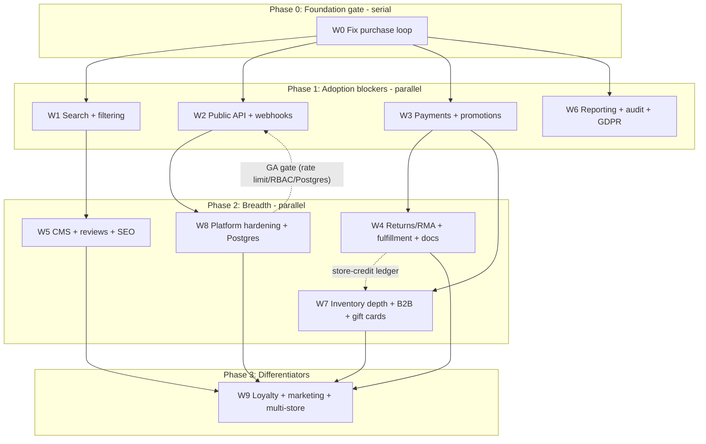

# bermooda Phase 2 — Phased Execution Plan (OSS Competitor)

This is the **operating layer** on top of the detailed spec in [.cursor/plans/oss-competitor-roadmap_b3f9a1c7.plan.md](.cursor/plans/oss-competitor-roadmap_b3f9a1c7.plan.md). The roadmap holds the full per-task detail (W#-#), schema lists, and validation gates. This plan groups that work into **phases** (dependency-gated waves) and **chunks** (one workstream = one handoff unit), and adds the coordination contracts needed for parallel execution.

Findings verified current: no `app/core/bootstrap*`; providers only registered in cores/tests; `taxCents = 0` hardcoded at [app/core/orders/index.server.js](app/core/orders/index.server.js); no search domain/route; no real public API.

## How to use this plan (handoff model)

- **Chunk = unit of handoff.** One engineer/agent owns one chunk end-to-end (schema → core → routes → tests → validation gate → PR).
- **Phase = wave.** All chunks in a phase share the same upstream gate; chunks **within** a phase run in **parallel**.
- **Each chunk brief lists:** Depends on / Unblocks / Owns / Shared surfaces (coordinate) / Done (validation gate) / Detail link.
- **First step of every chunk:** re-confirm the roadmap finding still holds, then work.
- **Global conventions** (apply to all): roadmap "Conventions" section — domain logic in `app/core/<domain>/index.server.js`, JS/JSX + `#/*` alias, `#/utils/logger.server`, every Prisma change ships a migration + `npx prisma generate`, register routes in [app/routes.js](app/routes.js) in the same change, 80% coverage on new `app/core/**`.

## Phase + dependency graph

---

## Phase 0 — Foundation gate (serial, 1-2 engineers)

Nothing customer-facing is real until this lands. **Internal order:** W0-1 (bootstrap) first — it unblocks W0-3/W0-4; then W0-2, W0-5, W0-6 in parallel; W0-3 + W0-4 together after W0-1.

**W0 — Fix the broken purchase loop**

- Depends on: nothing.
- Unblocks: **everything** (W1, W2, W3, W6 cannot start meaningfully until the purchase loop + bootstrap pattern exist).
- Owns: new `app/core/bootstrap/index.server.js` (`registerBuiltins()`), startup hook in [app/entry.server.jsx](app/entry.server.jsx); changes to [app/core/orders/index.server.js](app/core/orders/index.server.js), [app/core/payments/stripe.server.js](app/core/payments/stripe.server.js), checkout review step [app/routes/storefront/checkout/$step.jsx](app/routes/storefront/checkout/$step.jsx); event subscriber for `payment.*`; `CheckoutSession` totals columns.
- Shared surfaces (establishes the seams everyone else builds on): the **bootstrap extension pattern**, the **domain-event names + subscriber registration**, the **inventory mutation seam** (`incrementInventory`/`decrementInventory`), and the **totals computation** location.
- Done: roadmap W0 validation gate — seed → cart → 4-step checkout → Stripe test card → webhook marks paid → confirmation email → refund restores stock; totals include tax; lint + build + targeted tests green.
- Detail: roadmap "W0".

---

## Phase 1 — Adoption blockers + independents (parallel, up to 4 lanes)

All four gate only on W0 and live in mostly separate domains. Coordinate only on the shared surfaces noted below.

**W1 — Storefront search + filtering** (lane A)

- Depends on: W0. Unblocks: W5.
- Owns: `app/core/search/index.server.js` (provider registry + built-in DB provider), `app/routes/storefront/search.jsx`, search box in default theme, `ProductAttribute`/`ProductAttributeValue` schema.
- Shared: [app/routes.js](app/routes.js) (+`/search`), `prisma/schema.prisma`, default theme header, bootstrap (register search provider).
- Done: roadmap W1 gate (relevant results + facets on SQLite and Postgres).

**W2 — Public API + outbound webhooks** (lane B)

- Depends on: W0. Unblocks: W8 (hardening targets the API). **GA-gated on W8** (rate limiting/RBAC/Postgres) — build now, promote for real use after W8.
- Owns: `app/routes/api/**` (`/api/v1/*` storefront, `/api/admin/v1/*` admin — thin handlers over `app/core/*`), `ApiKey`/`WebhookSubscription`/`WebhookDelivery` schema, webhook delivery worker on the LiteQuu queue, `docs/api.md`.
- Shared: [app/routes.js](app/routes.js), `prisma/schema.prisma`, domain-event names (consumes W0's bus). **API parity for later domains (W3/W4/W7) is each of those chunks' responsibility**, not a W2 bottleneck.
- Done: roadmap W2 gate (scripted client browse→cart→checkout; signed + retried webhook).

**W3 — Payment breadth + promotions engine** (lane C)

- Depends on: W0. Unblocks: W4, W7.
- Owns: `app/core/payments/paypal/index.server.js` + manual/offline provider, saved methods/Payment Element, address-validation provider interface, promotions rules engine in [app/core/discounts/index.server.js](app/core/discounts/index.server.js), tax classes; `CartDiscount`/`OrderDiscount`/`TaxClass` schema + `Discount` extensions.
- Shared: **owns the totals-engine refactor** (multi-discount + tax classes) — W7 builds on it; `prisma/schema.prisma` (touches `Order`/`Discount`); bootstrap (register new payment providers).
- Done: roadmap W3 gate (>=2 payment methods; stacked + automatic discounts persist; tax classes apply).

**W6 — Reporting, audit, compliance** (lane D)

- Depends on: W0 (event bus for audit). Unblocks: nothing (leaf until W9).
- Owns: `app/core/reporting/index.server.js`, report/export admin routes, `AuditLog` schema + viewer, GDPR export/erasure.
- Shared: [app/routes.js](app/routes.js), `prisma/schema.prisma`, the queue (scheduled exports), domain events (audit subscribes to mutations).
- Done: roadmap W6 gate (reports match fixtures; exports download; audit entries on mutations; erasure anonymizes).

---

## Phase 2 — Breadth built on Phase 1 (parallel, up to 4 lanes)

**W4 — Returns/RMA + fulfillment depth + documents** (lane A) — Depends on: W3. Owns `Return`/`ReturnLine`/`StoreCreditLedger`, partial-fulfillment `Shipment`/`OrderLine` changes, PDF packing slips/invoices, lifecycle emails. **Publishes the store-credit ledger interface that W7 gift cards consume — define it early.** Shared: `prisma/schema.prisma` (`Order`/`OrderLine`), [app/emails](app/emails), events. Done: roadmap W4 gate.

**W5 — CMS + reviews + SEO** (lane B) — Depends on: W1. Owns `Page`/`Menu`/`MenuItem`/`Review` schema, admin CRUD, `/:slug` rendering, JSON-LD + sitemap. Shared: [app/routes.js](app/routes.js), `prisma/schema.prisma`, default theme (consumes W0-6 theme decision + W1 search box). Done: roadmap W5 gate.

**W7 — Catalog/inventory depth + B2B + gift cards** (lane C) — Depends on: W3 (price lists resolve in totals); **gift cards depend on W4 store-credit ledger.** Owns `Location`/`InventoryLevel`/`CustomerGroup`/`PriceList`/`GiftCard`/`Wishlist` + digital/bundles. **Migrates `ProductVariant.inventoryCount` to location-aware levels — must keep W0's `incrementInventory`/`decrementInventory` seam working.** Shared: totals engine (from W3), `prisma/schema.prisma`, inventory events. Done: roadmap W7 gate.

**W8 — Platform hardening + Postgres** (lane D) — Depends on: W2. **Land before W2 public GA.** Owns env-driven datasource in [prisma/schema.prisma](prisma/schema.prisma) + Postgres path, granular RBAC, rate limiting (auth/API/webhooks), image optimization, plugin/theme runtime completion, caching. Shared: schema datasource block (coordinate with all in-flight migrations), admin middleware. Done: roadmap W8 gate (runs on Postgres in CI; RBAC denies; rate limits trip; responsive images; sample plugin renders block).

---

## Phase 3 — Differentiators

**W9** — Depends on: W4 + W5 + W7 + W8. Loyalty/referrals, marketing automation, multi-store/sales channels. Sub-items parallelizable. Detail: roadmap "W9".

---

## Cross-cutting coordination (required for parallel handoff)

These are the seams where parallel chunks collide. Owners must follow these contracts.

- **`prisma/schema.prisma` (top conflict risk).** Every chunk adds models here. Rule: add new models in a clearly delimited per-chunk section; **never edit the same existing model concurrently** without a heads-up. Known hot models: `Order`/`OrderLine` (W0, W3, W4), `Discount` (W3), `ProductVariant.inventoryCount` (W0 seam vs W7 migration), `CheckoutSession` (W0). Designate a **schema integrator** to serialize migration generation (Prisma migration history is linear — parallel `prisma:migrate` causes ordering/drift). Merge schema PRs small and often; regenerate `prisma/generated/` on every merge.
- **[app/routes.js](app/routes.js).** Append-only registration → low textual conflict but everyone edits it. Each chunk appends its own block; rebase frequently. Keep route module + `routes.js` change in one commit (repo rule).
- **`app/core/bootstrap/index.server.js` (created by W0).** W0 defines `registerBuiltins()` with a per-domain `registerX()` extension pattern. Downstream chunks (W1 search provider, W3 payment providers, W2/W4/W6 event subscribers) add one call + their own register fn — no rewrites.
- **Domain-event names + bus.** W0 establishes canonical events (`payment.succeeded`, `order.confirmed`, ...). W2 (webhook fan-out), W4 (`order.returned`, lifecycle emails), W6 (audit), W7 (inventory/back-in-stock) **subscribe**. Maintain a single shared list of event names; don't rename without notice.
- **Totals/pricing engine.** Single computation path (checkout review + `placeOrder`). W0-2 (tax persist) lands first; **W3 owns the multi-discount + tax-class refactor**; W7 extends it for price-list resolution. Sequence W3 totals work before W7 totals work.
- **Inventory seam.** W0-5 calls `incrementInventory`/`decrementInventory`; W7 swaps the implementation to location-aware. Keep these function signatures stable so W7 is a drop-in.
- **Default theme + W0-6 decision.** W0-6 (import-based vs registry theme runtime) must be settled before W1/W5 add significant storefront UI.
- **Store-credit ledger.** W4 defines it; W7 gift cards consume it. W4 publishes the interface early so W7 isn't blocked.

## Staffing model

- Phase 0: 1-2 (W0-1 first, then split). Phase 1: up to 4 parallel. Phase 2: up to 4 parallel. Phase 3: 1+.
- Minimum viable path if single-threaded: W0 → W2 → W8 (working store + API) then breadth.

## Per-chunk definition of done (PR checklist)

1. Roadmap finding re-confirmed against current code.
2. Prisma migration created (`npm run prisma:migrate -- --name <snake>`) + `npx prisma generate`; `prisma/generated/` updated.
3. Domain logic in `app/core/<domain>`; routes orchestrate only; 80% coverage on new core.
4. Routes registered in [app/routes.js](app/routes.js); public/admin API endpoints added for the chunk's new capability (if applicable).
5. Chunk's roadmap validation-gate scenario passes; `npm run lint` + `npm run build` green.
6. Shared-surface contracts above respected; docs updated where the roadmap calls for it (`docs/api.md`, etc.).
