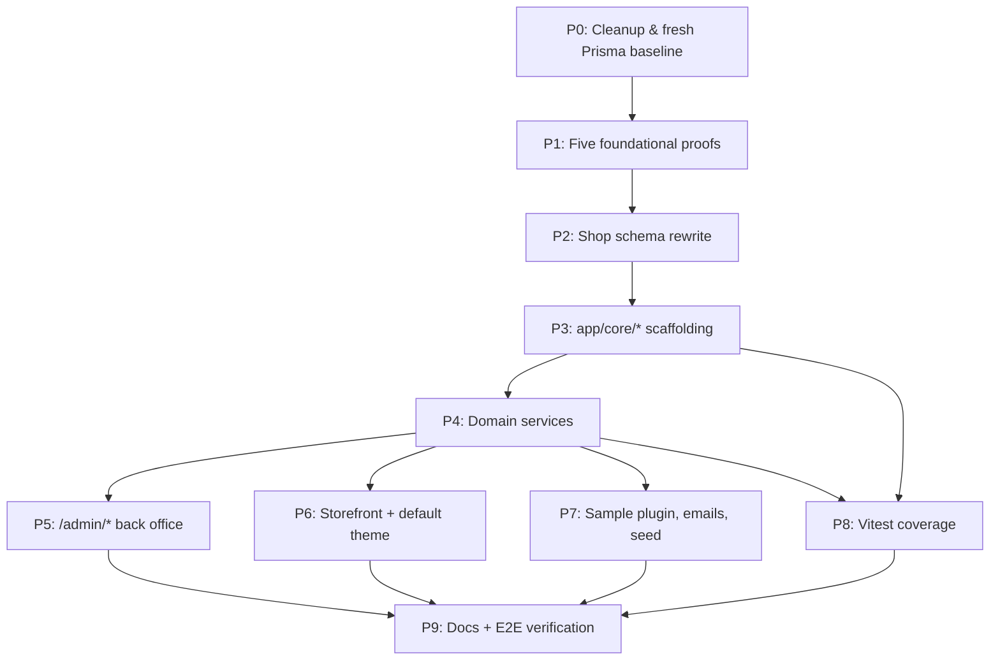

# bermooda Phase 1 — Phased Subagent Breakdown

## What this plan produces

Replace the tail of [docs/phase-1-plan.md](docs/phase-1-plan.md) (the `Preflight implementation checkpoints`, `Critical files to modify or create`, and `Verification` sections) with the 10-phase execution plan below. Keep every other section as-is — `Context`, `Repo verification constraints`, `High-level architecture`, `Auth model`, `Data model`, `Multi-currency`, `i18n`, `Storage`, `Theme contract`, `Plugin contract`, `Payment / shipping / tax flow`, `Admin back office`, `Testing (Vitest)`, `Removals & cleanup`, `Out of scope`. Those are the spec; the phases below are the execution path through the spec.

## How to use with subagents

- **Sequential phases:** dispatch only after the prior phase's exit criteria pass.
- **Parallel tasks within a phase:** each task lists the files it owns; do not dispatch two tasks that write the same file in parallel.
- **Serialization points** (shared files): P0-5, P2-6, P3-2, P4-C/D, P6-1 land alone because they touch `prisma/schema.prisma` or [app/routes.js](app/routes.js). An "assembler" subagent merges drafts if multiple engineers drafted in parallel.
- **Validation gates:** each phase ends with `npm run lint` + `npm run build` + the targeted tests for that phase. Do not advance until green.

## Dependency graph

---

## Phase 0 — Cleanup & fresh Prisma baseline

**Goal.** Remove SaaS/org/Polar scaffolding; rewrite agent rules; land a fresh Prisma baseline with SaaS models dropped and `User.role` added.
**Depends on:** —
**Exit gate:** `npm run lint` clean; `npm run build` clean; `npm run setup` works on a fresh DB; no references remain to `Organization`, `Member`, `Invitation`, `Subscription`, or Polar.

Tasks P0-1..P0-4 are parallel. P0-5 runs last because P0-2 and P0-3 remove the callers of the models P0-5 drops.

- **P0-1. Rewrite architecture rules (parallel).** Owns [.cursor/rules/general.mdc](.cursor/rules/general.mdc), [.cursor/rules/libs-services.mdc](.cursor/rules/libs-services.mdc), [.cursor/rules/react-router/routes.mdc](.cursor/rules/react-router/routes.mdc), [AGENTS.md](AGENTS.md). Replace `app/services/*` guidance with `app/core/*` as the domain layer; keep `app/libs/*` as infrastructure.
- **P0-2. Drop SaaS/org routes + services (parallel).** Delete [app/routes/app/](app/routes/app/) (all files), [app/routes/organization/accept-invitation.jsx](app/routes/organization/accept-invitation.jsx), [app/routes/checkout/polar.jsx](app/routes/checkout/polar.jsx), [app/routes/webhooks/polar.jsx](app/routes/webhooks/polar.jsx), [app/services/polar.server.js](app/services/polar.server.js). Remove the corresponding entries from [app/routes.js](app/routes.js).
- **P0-3. Drop Polar + org from config/auth/landing (parallel).** Remove `@polar-sh/remix` from [package.json](package.json); drop `polar.plans` from [app/config.js](app/config.js); strip the `/checkout/polar` CTA from [app/components/landing/hero.jsx](app/components/landing/hero.jsx); remove the `organization` plugin block from [app/libs/auth/index.server.js](app/libs/auth/index.server.js) and the `organizationClient` import from [app/libs/auth/client.js](app/libs/auth/client.js).
- **P0-4. Polish drive-bys (parallel).** In [app/utils/logger.server.js](app/utils/logger.server.js) set Pino `name` to `bermooda`. In [README.md](README.md) change dev URL `5173` → `3000`.
- **P0-5. Fresh Prisma baseline (last).** In [prisma/schema.prisma](prisma/schema.prisma) drop `Organization`, `Member`, `Invitation`, `Subscription`, `Session.activeOrganizationId`; add `role Role` on `User` with enum `Role { admin, staff }`. Wipe [prisma/migrations/](prisma/migrations/) and regenerate a single `0000_init` migration.

---

## Phase 1 — Five foundational proofs

**Goal.** De-risk the architecture decisions that block the main build. All five tasks are independent and parallel.
**Depends on:** Phase 0.
**Exit gate:** each proof has a smoke test recorded in its docs file; CI green for lint + build.

- **P1-A. Dual better-auth instances.** Create [app/libs/auth/admin.server.js](app/libs/auth/admin.server.js) (from current `index.server.js`: drop `organization`, cookie prefix `bermooda_admin_`, `baseURL` path `/admin/auth/*`, keep `twoFactor`). Create [app/libs/auth/customer.server.js](app/libs/auth/customer.server.js) with a separate `betterAuth()` instance using the `Customer*` models via `prismaAdapter` schema mapping, cookie prefix `bermooda_customer_`, base path `/account/auth/*`. Add [app/libs/auth/admin-client.js](app/libs/auth/admin-client.js) and [app/libs/auth/customer-client.js](app/libs/auth/customer-client.js). Prove coexistence on one Prisma client; if the Prisma 7 adapter cannot map `Customer*` directly, ship the smallest table-mapping shim. Smoke: staff + customer logged in simultaneously with two cookies. Record mapping + smoke in [docs/auth.md](docs/auth.md).
- **P1-B. Static dispatcher routing proof.** Add skeleton [app/core/plugins/index.server.js](app/core/plugins/index.server.js) with `loadPlugins()` and `resolvePluginRoute(id, path)`. Add skeleton [app/core/themes/index.server.js](app/core/themes/index.server.js) with `resolveActiveTheme()` + `getStorefrontComponent(name)`. Wire `/apps/:pluginId/*` as a static dispatcher in [app/routes.js](app/routes.js) rendering the resolved descriptor, and add one storefront route that delegates rendering to a theme component. Confirm no path mutates routes at runtime.
- **P1-C. Storage client API.** Create [app/core/storage/client.server.js](app/core/storage/client.server.js) with an S3-compatible wrapper reading `STORAGE_ENDPOINT`, `STORAGE_REGION`, `STORAGE_BUCKET`, `STORAGE_ACCESS_KEY`, `STORAGE_SECRET_KEY`, `STORAGE_PUBLIC_URL`. Expose `putObject`, `getObjectUrl`, `deleteObject`. Add vars to [.env.example](.env.example). Write [docs/storage.md](docs/storage.md) with `fly storage create` steps, local-dev behavior, failure modes.
- **P1-D. CI workflows.** Create `.github/workflows/ci.yml` with `lint` and `build` jobs (test job added in Phase 8). Decide: move existing `.github/_workflows/fly.yml` to `.github/workflows/fly.yml` or delete it — document the choice in the PR.
- **P1-E. Vitest skeleton.** Add `vitest`, `@vitest/coverage-v8`, `@testing-library/react`, `@testing-library/jest-dom`, `happy-dom`, `supertest`. Create `vitest.config.js` (unit + server projects, `#` alias, non-enforcing coverage threshold `{'app/core/**': 80}`). Scripts: `test`, `test:watch`, `test:coverage`. Add one smoke test so CI has something to run.

---

## Phase 2 — Shop schema rewrite

**Goal.** Land the full ecommerce Prisma schema in a single migration on top of the Phase 0 baseline.
**Depends on:** Phase 0 (baseline), P1-A (customer model names).
**Exit gate:** `prisma validate` clean; `prisma migrate reset` + `npm run setup` clean; `prisma generate` updates [prisma/generated/](prisma/generated/); unique indices on `Slug`, `Translation`, `VariantPrice`, `PluginData`, `WebhookEvent` enforced.

P2-1..P2-5 are parallel drafting; P2-6 is the single assembler.

- **P2-1. Catalog models.** `Product`, `ProductVariant` (no price), `VariantPrice` (`@@unique([variantId, currency])`), `ProductOption`, `ProductOptionValue`, `Category`, `ProductCategory`, `Media`, `ProductMedia`.
- **P2-2. Customer + address models.** `Customer`, `CustomerSession`, `CustomerAccount`, `CustomerVerification`, optional `CustomerTwoFactor`, `Address` — matching P1-A decisions.
- **P2-3. Cart + checkout + orders.** `Cart`, `CartLine` (with `priceCentsSnapshot`, `titleSnapshot`), `CheckoutSession`, `Order` (denormalized address JSON, `createdAt` is placement), `OrderLine`, `Shipment`, `Refund`.
- **P2-4. Misc models.** `Discount`, `PluginData` (`@@unique([pluginId, key])`), `Setting` (unique `key`), `Translation` (`@@unique([entityType, entityId, locale, field])`), `Slug` (two unique indices), `WebhookEvent` (`@@unique([provider, eventId])`).
- **P2-5. User role confirmation.** Verify `User.role` is the only SaaS-era field change; no stray columns remain.
- **P2-6. Assemble + migrate (last).** Merge drafts into [prisma/schema.prisma](prisma/schema.prisma), run `npx prisma format`, `npm run prisma:migrate -- --name initial-shop`, commit schema + migration + generated client together.

---

## Phase 3 — `app/core/*` scaffolding

**Goal.** Build the shop engine — no UI — as the stable surface admin and storefront consume.
**Depends on:** Phase 2.
**Exit gate:** every module exports the functions its consumers will call; [app/core/index.js](app/core/index.js) re-exports the theme/plugin surface with no circular imports; no `app/core/*` module imports from `app/routes/*`; P3-6..P3-8 unit tests pass.

**Tier 1 (sequential foundation).**

- **P3-1. Scaffold directories.** Create empty modules under `app/core/{catalog,cart,checkout,orders,customers,payments,shipping,tax,settings,events,plugins,themes,i18n,currency,storage}`. Each exports a named object even if the body is a TODO.
- **P3-2. Public surface.** Create [app/core/index.js](app/core/index.js) re-exporting `useShop`, `useT`, `formatPrice`, `<Slot />`, selectors, and DTOs. Internals remain unexported.
- **P3-3. Event bus.** `app/core/events/index.server.js` — `emit(event, payload)`, `on(event, handler)`, registration-order dispatch, error isolation for non-checkout-critical paths.

**Tier 2 (parallel after Tier 1).**

- **P3-4. Plugin loader.** Manifest validation; `defineHooks()` and `defineProvider('payment'|'shipping'|'tax', spec)`; hook dispatcher awaited in registration order; `ctx = { db, settings, plugin: { get, set, delete }, logger, queue, emit, t }`; `PluginData` namespaced by `pluginId`; `enable`/`disable` lifecycle + optional `onEnable`/`onDisable`.
- **P3-5. Theme loader.** `defineTheme()` with build-time required-component validation; active theme resolver (TTL-cached via `Setting.activeTheme`); `<Slot />` with ~10 well-known slot names; block order from `Setting.pluginOrder`.
- **P3-6. Settings service.** `get(key)`, `set(key, value)` read-through TTL-cached via [app/utils/cache.server.js](app/utils/cache.server.js). Seed defaults: `defaultCurrency=USD`, `currencies=['USD','EUR','AUD']`, `defaultLocale=en`, `activeTheme=default`.

**Tier 3 (parallel after Tier 2 — depend on Settings).**

- **P3-7. i18n resolver.** `getRequestLocale(request)` with resolution chain `locale` cookie → customer `preferredLocale` → `Accept-Language` negotiation → `defaultLocale`; `useT()` + server `t(key, params)`; catalog merging across `app/core/i18n/messages/`, `app/themes/<name>/i18n/`, `app/plugins/<name>/i18n/`; write-through cookie on resolution.
- **P3-8. Currency service.** `getRequestCurrency(request)`; `lookupVariantPrice(variantId, currency)` exact match for cart/checkout; `lookupVariantPriceForBrowsing(variantId, currency)` with default-currency fallback + `isFallback` flag; `formatPrice(cents, currency?, locale?)` via `Intl.NumberFormat`.
- **P3-9. Storage finalize.** Promote the P1-C prototype into `app/core/storage/index.server.js`; add `uploadMedia(file)` returning `{ url, storageKey, mimeType, width, height }`.

---

## Phase 4 — Domain services

**Goal.** Business workflows that use the core scaffolding.
**Depends on:** Phase 3.
**Exit gate:** totals, cart, discount, inventory, provider registry services callable from scripts; Stripe adapter verifies a mocked webhook; Tier-2 services compile and are reachable from routes.

**Tier 1 (parallel).**

- **P4-A. Catalog service** — `app/core/catalog/*`: product/variant/category CRUD for admin, slug resolution via `Slug`, media association. Reads `VariantPrice` rows per currency.
- **P4-B. Cart service** — `app/core/cart/*`: `addLine`, `removeLine`, `updateQuantity`; currency lock on first add; `priceCentsSnapshot` + `titleSnapshot` at add-time (locale-resolved); expiry; guest→customer merge on login with token rotation.
- **P4-E. Payment registry + Stripe adapter** — `app/core/payments/*` and `app/core/payments/stripe.server.js`. **Rewrite** of [app/services/stripe.server.js](app/services/stripe.server.js) (not a move): drop subscription `checkout.session` helper + `customer.subscription.*`; keep one-time Stripe Checkout with dynamic `price_data`, signature verification, idempotency on `(provider, eventId)`, refunds, Pino logging.
- **P4-F. Shipping registry + flat-rate adapter** — `app/core/shipping/*`: per-region flat rates, free-over-X, config in `Setting`.
- **P4-G. Tax registry + simple-percent adapter** — `app/core/tax/*`: per country/region percent, shop-wide `tax.mode = inclusive | exclusive`.
- **P4-H. Inventory.** Atomic decrement inside a transaction; `inventoryTracked=false` skip; `INSUFFICIENT_INVENTORY` error.
- **P4-I. Discount engine** — percent vs fixed, min subtotal, expiry, max-uses with atomic `usedCount++`.
- **P4-J. Customer service** — profile, address book, order history; bridges to the customer auth instance from P1-A.

**Tier 2 (sequential after Tier 1).**

- **P4-C. Totals + checkout pipeline** — `app/core/checkout/totals.server.js` (formula from spec) and `app/core/checkout/pipeline.server.js` 4-step state machine on `CheckoutSession` (address → shipping → payment → review). Server re-computes on every mutation and at placement.
- **P4-D. Order service** — `app/core/orders/*`: transactional `placeOrder()` (decrement inventory, snapshot addresses, create `OrderLine`s, clear cart, emit `order.created`); status transitions; refund flow emits `payment.refunded`; `Shipment` fulfillment.
- **P4-K. Webhook dispatcher** — new [app/routes/webhooks/$provider.jsx](app/routes/webhooks/$provider.jsx) generic route: resolves provider from registry, calls `verifyWebhook()`, writes to `WebhookEvent` (skip on duplicate), emits `payment.*` events. Delete the old `app/routes/webhooks/stripe.jsx` and wire Stripe through the dispatcher.

---

## Phase 5 — `/admin/*` back office

**Goal.** Core-owned admin UI against Phase 4 services.
**Depends on:** Phase 4. **Parallel with:** Phase 6, Phase 7.
**Exit gate:** admin seed user can log in, CRUD a product with translations + multi-currency prices + media, build a category tree, place a manual order, issue a refund, toggle a plugin, switch a theme, edit settings.

- **P5-1. Admin shell (first).** Create [app/routes/admin/public/\_layout.jsx](app/routes/admin/public/_layout.jsx) with `login`, `forgot-password`, `reset-password`, `verify-2fa`, `logout`. Create [app/routes/admin/\_layout.jsx](app/routes/admin/_layout.jsx) with RR7 route middleware calling into `admin.server.js`; redirect `/admin/login` on failure. Build sidebar + topbar (search, admin user menu, dark-mode toggle, locale switcher via `useT()`). Add all routes to [app/routes.js](app/routes.js).

Parallel after P5-1:

- **P5-2. Dashboard** — KPI tiles (orders, revenue, abandoned checkouts, low-stock), recent orders, `dashboard.widgets` slot.
- **P5-3. Products admin** — list + editor with locale tabs, options + variants editor, **per-currency price grid** writing `VariantPrice`, media uploader → `app/core/storage`, category picker, SEO.
- **P5-4. Categories admin** — tree editor with drag-to-reorder (`position`), locale tabs, localized `Slug`.
- **P5-5. Orders admin** — list/filter, detail (line items, payment events, fulfillment, refund button, manual notes).
- **P5-6. Customers admin** — list/search, detail (addresses, order history), manual create.
- **P5-7. Discounts admin** — CRUD.
- **P5-8. Themes admin** — list from [app/themes/](app/themes/), selection, manifest-driven settings form, storefront preview link.
- **P5-9. Plugins admin** — list from [app/plugins/](app/plugins/), enable/disable, drag-to-reorder (`Setting.pluginOrder`), manifest-driven settings form, link to plugin admin pages.
- **P5-10. Settings admin** — shop name, contact email, currencies + default (USD/EUR/AUD seeded enabled, USD default), locales + default, tax mode, tax regions, shipping zones, admin user CRUD, email templates preview.
- **P5-11. Plugin admin dispatcher** — static `/admin/plugins/:pluginId/*` route resolving descriptors from the plugin's `admin/routes.js`.

---

## Phase 6 — Storefront + default theme + customer auth UI

**Goal.** Themed, cookie-locale storefront with full shopping flow and customer account area.
**Depends on:** Phase 4. **Parallel with:** Phase 5, Phase 7.
**Exit gate:** guest can browse → add-to-cart → 4-step checkout → Stripe test payment → order confirmation; locale + currency switchers persist via cookies; customer can register, log in, view orders, manage addresses.

- **P6-1. Storefront routes (first).** Extend [app/routes.js](app/routes.js) with `/`, `/products/:slug`, `/categories/:slug`, `/cart`, `/checkout/:step`, `/thank-you/:orderNumber`, `/account/*` + `/account/login|register|forgot-password|reset-password|logout`, `/apps/:pluginId/*`. Loaders live in `app/routes/storefront/*` and call `app/core/*`.
- **P6-2. Default theme skeleton (first).** [app/themes/default/manifest.js](app/themes/default/manifest.js), `routes.js` (component mappings), `i18n/en.json`, and stubs for every required component.

Parallel after P6-1 + P6-2:

- **P6-3. Core theme components** — `Layout`, `HomePage`, `ProductCard`, `ProductGrid`, `NotFoundPage`.
- **P6-4. Product + category pages** — `ProductPage` (with `product.afterDescription` slot), `CategoryPage`.
- **P6-5. Cart page** — line editor, totals, currency-mismatch warnings.
- **P6-6. Checkout UI** — `CheckoutLayout`, step components (Address, Shipping, Payment, Review), `CheckoutThankYouPage`.
- **P6-7. Customer auth UI** — `LoginPage`, `RegisterPage`, `ForgotPasswordPage`, `ResetPasswordPage` wired to the customer better-auth instance.
- **P6-8. Account area** — `AccountLayout`, orders list, order detail, addresses, profile.
- **P6-9. Locale + currency switchers** — cookie writers that revalidate without navigation; admin reuses the locale switcher.
- **P6-10. Default theme translations** — populate `en.json`; optionally `de.json` + `fr.json` for the E2E flow.

---

## Phase 7 — Sample plugin, shop emails, seed

**Goal.** Prove the plugin contract end-to-end, ship transactional emails, and produce a deterministic seed for E2E verification.
**Depends on:** Phase 4. **Parallel with:** Phase 5, Phase 6.
**Exit gate:** `npm run seed` yields an admin + default theme + enabled sample plugin; placing a test order queues the confirmation email; sample plugin's admin page lists the captured `order.created` event.

All four tasks are parallel.

- **P7-1. sample-analytics plugin** — [app/plugins/sample-analytics/manifest.js](app/plugins/sample-analytics/manifest.js), `index.server.js` (hooks `order.created` → append to `PluginData`), `admin/routes.js` (recent-events page), `blocks/product/after-description.jsx`, `i18n/en.json`.
- **P7-2. Shop email templates** — [app/emails/shop/order-confirmation.jsx](app/emails/shop/order-confirmation.jsx), `password-reset-admin.jsx`, `password-reset-customer.jsx`, `customer-welcome.jsx`, `abandoned-cart.jsx` as React Email templates accepting a `locale` prop.
- **P7-3. Queue jobs** — extend [app/emails/job.server.js](app/emails/job.server.js) with `queueOrderConfirmation`, `queueCustomerWelcome`, `queueAbandonedCart`. Subscribe via the event bus to `order.created` and `customer.registered`.
- **P7-4. Seed script** — add `npm run seed` in [package.json](package.json) + `prisma/seed.js`: 1 admin (`role=admin`, email verified), `Setting` defaults (USD default, USD/EUR/AUD enabled, `activeTheme=default`), `sample-analytics` in `Setting.enabledPlugins`, optional demo product + variant + prices.

---

## Phase 8 — Vitest coverage

**Goal.** Hit the 17 v1 coverage targets with `app/core/**` ≥ 80%.
**Depends on:** Phase 3 (ongoing) and Phase 4 (for integration tests); built on P1-E. **Parallel with:** Phase 5, 6, 7.
**Exit gate:** `npm run test:coverage` green; `app/core/**` ≥ 80%; CI runs `test:coverage` on PRs.

P8-1 + P8-2 come first; P8-3..P8-19 are one coverage target each, all parallel.

- **P8-1. Test infrastructure finalize.** Finalize `vitest.config.js` (unit=happy-dom, server=node). `vitest-setup.js` runs `prisma migrate deploy` against a per-worker tmp SQLite via `@prisma/adapter-better-sqlite3`; truncate between tests.
- **P8-2. Factories + helpers.** `app/test/factories/{user,customer,product,variant,cart,order,setting}.js` + `app/test/helpers/{db,mocks,request}.js`.
- **P8-3..P8-19. Coverage targets (one subagent each).** Map 1-to-1 to the 17 targets in [docs/phase-1-plan.md](docs/phase-1-plan.md) §Testing: totals, cart, checkout pipeline, order service, plugin loader, theme resolver, provider registry, i18n resolver, translation service, currency service, Stripe adapter, webhook idempotency, discount engine, inventory, auth boundaries, sample plugin integration, default theme smoke.
- **P8-20. CI test job.** Add `test` job to `.github/workflows/ci.yml`, enforce the `app/core/**` 80% threshold.

---

## Phase 9 — Docs + E2E verification

**Goal.** Finalize developer docs and execute the 11-step manual flow.
**Depends on:** Phase 5, 6, 7, 8.
**Exit gate:** all 11 verification steps pass on a fresh DB; all listed docs exist and are accurate; `npm run lint`, `npm run build`, `npm run test:coverage` all green.

- **P9-1. [docs/themes.md](docs/themes.md)** — contract, slot list, helper hooks, fork-the-default walkthrough.
- **P9-2. [docs/plugins.md](docs/plugins.md)** — contract, manifest, hook list, `ctx` reference, sample plugin walkthrough.
- **P9-3. [docs/testing.md](docs/testing.md)** — conventions, factories, db-per-worker pattern, coverage targets.
- **P9-4. Finalize [docs/auth.md](docs/auth.md)** — both instances, cookie layout, middleware, isolation.
- **P9-5. Finalize [docs/storage.md](docs/storage.md)** — Tigris provisioning, env vars, local fallback, failure modes.
- **P9-6. E2E smoke run.** Execute the 11 steps from the original `Verification` section on a freshly seeded DB.
- **P9-7. Green build.** `npm run lint`, `npm run build`, `npm run test:coverage` all pass with `app/core/**` ≥ 80%.

---

## Subagent dispatch recipe

- One subagent per task. Prompt includes: task ID, owned file list, inputs/outputs, exit checks.
- Dispatch parallel tasks within a phase as a single batch; wait for all to return before running the phase validation gate.
- For serialization points (P0-5, P2-6, P3-2, P4-C, P4-D, P6-1, P8-1), dispatch alone.
- Consider `best-of-n-runner` for high-risk, shape-driven tasks like P4-E Stripe adapter and P3-4 plugin loader.
- Always run `npm run lint` + `npm run build` + targeted tests between phases; do not advance on red.

---

## Execution first step

Once this plan is approved, rewrite [docs/phase-1-plan.md](docs/phase-1-plan.md): keep all spec sections (`Context` through `Admin back office`, `Testing`, `Removals & cleanup`, `Out of scope`) and replace the three execution sections (`Preflight implementation checkpoints`, `Critical files to modify or create`, `Verification`) with the content of this plan, so a single doc serves as both spec and dispatch sheet.
