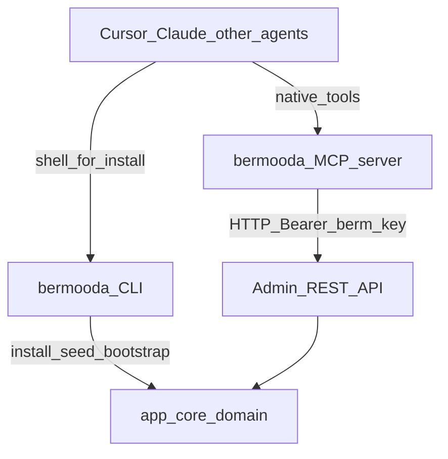
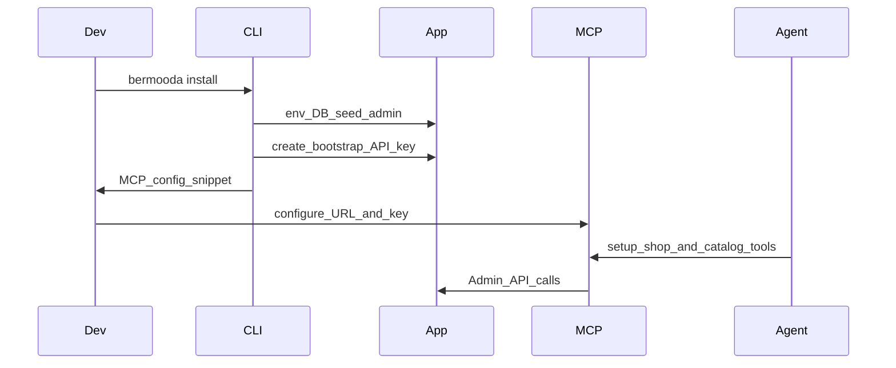

# First-class agent integration (MCP + API + CLI)

Architecture plan for letting tools like Cursor and Claude operate on a bermooda shop: query store data, update config and catalog, and help set up a shop after install.

## Verdict

**MCP is the right primary agent surface** for Cursor, Claude, and similar tools. **CLI alone is not.** A **direct REST Admin API remains the contract** both should call. You want all three in layers — not a single winner.

| Surface                              | Role                                                                          |
| ------------------------------------ | ----------------------------------------------------------------------------- |
| **Admin REST API** (`/api/admin/v1`) | Source of truth for read/write shop ops                                       |
| **MCP server**                       | First-class agent UX: typed tools, auth, discovery in Cursor/Claude           |
| **CLI** (`bermooda-cli`)             | Install, update, plugins/themes, local bootstrap — not day-to-day catalog ops |

Why not CLI-as-primary: agents must shell out, scrape stdout, and invent flags. That is brittle compared to MCP tool schemas. Why not MCP-only: install and first-boot still need a process outside a running shop (your existing CLI path). Why not invent a new proprietary agent protocol: MCP is already what those clients speak.

**Default scope:** merchant/dev agents against a **running shop** (remote or local URL + API key), plus a thin **bootstrap path** so post-install setup can become agent-driven. Not a Cursor-cloud-only internal tool.

---

## What you already have

Strong foundation in this repo:

- Admin API + `berm_` keys ([api.md](./api.md), [app/libs/auth/api/index.server.js](../app/libs/auth/api/index.server.js))
- Product CRUD, settings `GET/PATCH`, orders, discounts, imports, webhooks, etc. under [app/routes/api/admin/v1/](../app/routes/api/admin/v1/)
- Install CLI elsewhere ([cli-design.md](./cli-design.md) → `bermooda-cli`); in-app hook [scripts/cli-bootstrap.mjs](../scripts/cli-bootstrap.mjs)

Gaps that block “agent sets up a shop from scratch”:

- First admin / onboarding is UI-only ([app/core/admin-onboarding/index.server.js](../app/core/admin-onboarding/index.server.js))
- API key **create** is UI-only (chicken-egg for machines)
- No admin **categories** API (catalog taxonomy UI-only)
- Theme / plugin enablement not exposed on settings API
- Media upload missing from admin API
- Docs lag the real admin route surface

---

## Recommended architecture

### Layer 1 — Complete the machine API (in this repo)

Treat the Admin API as the agent contract. Before or alongside MCP, close bootstrap and catalog holes:

1. **Bootstrap / setup endpoints** (guarded: only when no admin, or via one-time setup token from CLI seed)
   - Create first admin (or document that seed/CLI already did)
   - Create first API key from a trusted bootstrap path (CLI after seed, or one-shot setup secret)
2. **Categories admin CRUD** mirroring products
3. **Theme / plugin** read+activate (or extend settings snapshot)
4. **OpenAPI** (or equivalent) generated/kept in sync — MCP and future SDKs derive from this
5. Document the full admin surface in [api.md](./api.md)

Do **not** put ecommerce workflows in MCP; MCP should call API → `app/core/*`.

### Layer 2 — MCP server (new package, likely sibling repo like CLI)

Ship `@bermooda/mcp` (or `bermooda-mcp`) as a **thin tool facade** over Admin API:

- **Transport:** stdio for local Cursor/Claude Desktop; optional Streamable HTTP later for hosted shops
- **Config:** `BERMOODA_URL` + `BERMOODA_API_KEY` (or MCP server config JSON)
- **Tools** grouped by intent, not 1:1 every REST route — e.g. `list_products`, `upsert_product`, `get_settings`, `update_settings`, `list_orders`, `update_order_status`, `import_products_csv`, `setup_shop` (orchestrates settings + seed catalog). Reporting tools map to `/api/admin/v1/reports/*` (overview, sales slices, ops, dashboard).
- **Resources** (optional): `bermooda://settings`, `bermooda://catalog/summary` for read-heavy context
- **Safety:** destructive tools require explicit confirm args; prefer dry-run flags on bulk ops

MCP implementation detail: reuse typed HTTP client against `/api/admin/v1`; no Prisma in the MCP process.

### Layer 3 — CLI stays lifecycle-focused

Keep [bermooda-cli](https://github.com/bermooda/bermooda-cli) for `install` / `update` / plugins / themes. Add only agent-friendly bootstrap helpers there, e.g.:

- After install: print/create bootstrap API key into `.env` / MCP config snippet
- `bermooda mcp init` → writes Cursor MCP config pointing at local/remote shop

Do not turn the CLI into a full catalog REPL; that duplicates MCP poorly.

### Layer 4 — Agent-facing docs / skill (lightweight)

A short “how agents use bermooda” doc + optional Cursor skill that points at MCP tools and bootstrap. Secondary to MCP; do not rely on prompting alone.

---

## “Setup shop from scratch” flow

Phase reality: **full zero-touch from bare metal without CLI is unnecessary** — install stays CLI; **post-install configuration and catalog** become MCP-native once an API key exists.

---

## Phased delivery

### Phase A — API readiness (this repo)

Bootstrap key path, categories CRUD, theme/plugin API hooks, OpenAPI + docs. Unblocks any agent client.

**Status (implemented in-repo):**

- `GET/POST /api/admin/v1/setup*` — first admin + first API key (`SETUP_TOKEN`)
- CLI/`prisma/seed.js` prints a bootstrap `berm_` key when none exist; writes `.bermooda/bootstrap-api-key` (+ optional `.env`); sets `adminSetupComplete`
- `POST /api/admin/v1/api-keys` + `DELETE /api/admin/v1/api-keys/:id`
- Categories admin CRUD; themes/plugins list+activate; inventory location create
- `docs/api.md` + `docs/openapi.yaml` expanded for agent contract

### Phase B — MCP MVP (new package)

stdio server: auth, settings, products, categories, orders list/status, CSV import. Cursor + Claude Desktop config examples.

**Status:** Implemented in [bermooda-mcp](https://github.com/bermooda/bermooda-mcp).

### Phase C — Setup orchestration

`setup_shop` tool + CLI `mcp init` / bootstrap key. Demo: empty/minimal seed → agent configures name, shipping, currencies, sample catalog.

**Status:** Implemented — MCP `setup_shop`; CLI `bermooda mcp init`; seed/bootstrap key file for init.

### Phase D — Harden

Granular API key scopes, audit log of agent mutations, media upload tools, webhook helpers, hosted HTTP MCP if you want cloud agents without local stdio.

**Status (implemented):**

- Granular scopes (`products:write`, …) with `admin` as super-scope
- Admin API mutation audit (`actorType: api_key`)
- `POST /api/admin/v1/media`, `PUT /api/admin/v1/inventory/levels`
- MCP webhook / media / inventory / themes / plugins tools + optional Streamable HTTP
- Still deferred: staff user create via API

---

## What not to do

- Do not make MCP call Prisma or `app/core` directly from a sidecar that shares the DB — keep HTTP boundary for auth, versioning, and multi-remote shops
- Do not replace the Admin API with MCP-only access — humans, Zapier, and scripts still need REST
- Do not expand CLI into the primary Cursor integration — use it to get MCP online
- Do not wait for perfect RBAC before MVP; start with existing `admin` scope + rate limits, tighten in Phase D

---

## Success criteria

- From Cursor/Claude, an agent can list/update products and settings against a local or remote shop using only MCP config (URL + key)
- After `bermooda install` (or seed), a documented path yields an API key + MCP config without requiring the Admin UI
- Categories and core shop settings are fully automatable over the same API MCP uses
- No new ecommerce domain logic outside `app/core/*`
