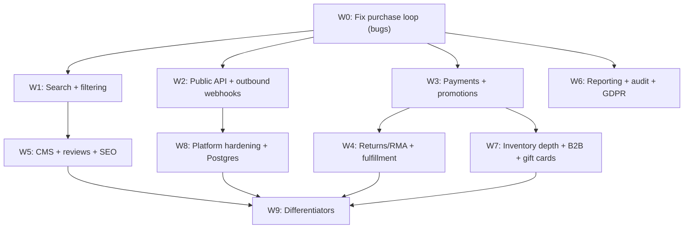

# bermooda — Phase 2: Open-Source Competitor Roadmap

## Context

Phase 1 (see [docs/phase-1-plan.md](docs/phase-1-plan.md)) delivered a clean, well-layered v1: a single React Router 7 SSR monolith with catalog, cart, a 4-step checkout pipeline, orders/refunds, pluggable payment/shipping/tax registries, a plugin + theme system, dual admin/customer auth with 2FA, i18n + multi-currency, transactional email, and a Vitest suite.

This plan covers what is **missing** to make bermooda a credible alternative to Medusa, Saleor, Vendure, Sylius, Bagisto, and WooCommerce. It is ordered by leverage: fix the broken happy-path first (W0), then close the biggest adoption blockers (search, API), then add commerce breadth.

The benchmark gaps were identified by auditing the runtime wiring, the Prisma schema, `app/core/*`, and `app/routes/*`.

## Conventions (apply to every workstream)

- Domain logic lives in `app/core/<domain>/index.server.js`; routes orchestrate and call core. Keep `app/libs/*` for infrastructure only (rule: `core -> libs` allowed, `libs -> core` not).
- JS/JSX (not TS) in `app/`; `#/*` import alias; no file extensions in imports; server log via `#/utils/logger.server`.
- Every Prisma change ships a migration: `npm run prisma:migrate -- --name <snake_case>`, then `npx prisma generate`, and confirm `prisma/generated/` updates.
- Each task ends with a validation gate: targeted tests + `npm run lint` + `npm run build`. New `app/core/**` code keeps the 80% coverage bar.
- Add new URLs to [app/routes.js](app/routes.js) in the same change that adds the route module.

---

## W0 — Fix the broken purchase loop (treat as bugs, do first)

**Goal.** Make a real guest purchase work end-to-end on a fresh DB. These are not new features; they are wiring gaps in shipped v1 code, so they block everything customer-facing.

**Findings being fixed**

- Built-in providers (`stripeProvider`, `flatRateProvider`, `simplePercentProvider`) and the default theme are only registered in tests — never at server startup. At runtime `listProviders()` is empty, so checkout offers no payment/shipping options.
- `placeOrder()` hardcodes `taxCents = 0`, so persisted order totals are wrong when tax applies. See [app/core/orders/index.server.js](app/core/orders/index.server.js).
- The storefront never initiates Stripe and the Stripe session carries no `metadata.orderId`, so `handleWebhookEvent` (which keys off `metadata.orderId`) can't reconcile a payment to an order. See [app/core/payments/stripe.server.js](app/core/payments/stripe.server.js).
- No event subscriber updates order status on `payment.succeeded`; orders stay `pending` forever.
- `incrementInventory()` exists but is never called on refund/cancel, so stock is not restored.

**Tasks**

- **W0-1. Startup bootstrap.** Reveal `app/entry.server.jsx` (or add a server-only singleton) and create `app/core/bootstrap.server.js` exporting `registerBuiltins()` that registers Stripe/flat-rate/simple-percent providers and the default theme, and discovers enabled plugins from `Setting.enabledPlugins`. Call it once at server start. Add a test asserting `listProviders()` is non-empty after bootstrap.
- **W0-2. Persist tax on order.** In the checkout `review` step, snapshot computed totals (`subtotal/discount/shipping/tax/total`) onto `CheckoutSession` (add columns) — or recompute tax inside `placeOrder()` using the session's `shippingAddressJson` via `computeActiveTax`. Remove the `taxCents = 0` shortcut and cover with a totals-on-order test.
- **W0-3. Wire Stripe initiation + reconciliation.** At the payment step, create the provider checkout session with `success_url`/`cancel_url` and `metadata.orderId` (create the `Order` in `pending` first, or pass the checkout session id and create the order on webhook — pick one and document it). Redirect the customer to the hosted Checkout. On `checkout.session.completed`, mark the order paid.
- **W0-4. Order status on payment events.** Add an event subscriber (registered in bootstrap) for `payment.succeeded`/`payment.failed`/`payment.refunded` that transitions order status and emits `order.confirmed`. Expand `VALID_ORDER_STATUSES` to include `paid`/`fulfilled` as needed (today the dashboard renders `paid`/`fulfilled` badges that the order service can't set).
- **W0-5. Restore inventory on refund/cancel.** Call `incrementInventory()` from refund/cancel flows in the order service; add a regression test.
- **W0-6. Decide theme runtime model.** Either (a) make storefront routes resolve components via `resolveActiveTheme()`/`getStorefrontComponent()` so `/admin/themes` actually switches the storefront, or (b) drop the dead registry and document themes as import-based. Today routes import `#/themes/default/...` directly, so the admin theme switcher is a no-op.

**Validation gate.** Seed → browse → add to cart → 4-step checkout → Stripe test card → webhook marks order paid → confirmation email → refund restores stock. Order totals include tax. `npm run lint` + `npm run build` + targeted tests green.

---

## W1 — Discovery: storefront search + filtering

**Goal.** Customers can find products. This is table stakes and currently absent (no `/search` route; admin search is slug-only).

**Tasks**

- **W1-1. Search provider interface.** Add `app/core/search/index.server.js` with a provider registry mirroring payments/shipping/tax: `registerProvider`, `search({ query, filters, sort, page })`. Ship a built-in DB provider (SQLite `LIKE`/Postgres `ilike` over translated title/description + SKU). Keep the interface ready for a Meilisearch/Typesense/Algolia plugin.
- **W1-2. Storefront search route.** Add `/search` to [app/routes.js](app/routes.js) + `app/routes/storefront/search.jsx` (loader calls core search; theme renders results via `ProductGrid`). Add a search box to the default theme header.
- **W1-3. Faceted filtering + sorting.** Category and search pages support filter by price range, category, availability, and product attributes; sort by price/newest/relevance. Reuse `listProducts` filters; extend with attribute facets.
- **W1-4. Product attributes for facets.** Introduce structured, filterable attributes (extend `ProductOption`/values or add a `ProductAttribute` model) so facets are data-driven, not hardcoded.

**Schema.** Optional `ProductAttribute`/`ProductAttributeValue`; search indexes on hot columns.

**Validation gate.** Search returns relevant products; facets narrow results; works on SQLite and Postgres. Core search tests + lint + build.

---

## W2 — Public API + outbound webhooks

**Goal.** Unblock headless storefronts, mobile apps, and ERP/3PL/marketplace integrations — the single biggest reason teams pick Medusa/Saleor/Vendure. `/api/*` is reserved but unimplemented.

**Tasks**

- **W2-1. Decide REST vs GraphQL** (document the choice; REST is the lighter lift given existing `app/core/*` functions). Reserve `/api/v1/*` and `/api/admin/v1/*`.
- **W2-2. API-key auth + scopes.** Add `ApiKey` model (hashed key, scopes, label, lastUsedAt). Middleware validates keys; storefront vs admin scopes. Rate-limit (see W8).
- **W2-3. Storefront API.** Catalog browse/search, cart CRUD, checkout, customer auth/orders — thin handlers over `app/core/*`. No business logic in route modules.
- **W2-4. Admin API.** Products/variants/prices, orders/fulfillment/refunds, customers, discounts, inventory — parity with admin UI actions.
- **W2-5. Outbound webhooks.** Add `WebhookSubscription` (url, events[], secret) + a delivery worker on the LiteQuu queue that signs and POSTs domain events (`order.created`, `order.fulfilled`, `payment.refunded`, …) with retries. Admin UI to manage subscriptions.
- **W2-6. API docs.** Generate/maintain an OpenAPI (or GraphQL schema) doc + `docs/api.md`.

**Schema.** `ApiKey`, `WebhookSubscription`, `WebhookDelivery` (attempts/status).

**Validation gate.** A scripted client completes browse→cart→checkout via the API; an outbound webhook is signed, delivered, and retried on failure. Contract tests + lint + build.

---

## W3 — Payment breadth + promotions engine

**Goal.** More than one way to pay, and real promotions. Today only Stripe Checkout exists and only one coupon per order is possible (`couponCode` is a single string).

**Tasks**

- **W3-1. PayPal provider.** Implement the payment provider interface in `app/core/payments/paypal.server.js`; register in bootstrap; surface at the payment step alongside Stripe.
- **W3-2. Manual/offline method.** Bank transfer / cash-on-delivery / "pay on invoice" provider that places the order in a `pending_payment` state for admin confirmation — important for many self-hosted merchants.
- **W3-3. Saved payment methods + express checkout.** Optional Stripe customer + Payment Element path; Apple/Google Pay via the Element.
- **W3-4. Address validation/autocomplete.** Pluggable provider interface (built-in no-op; Google/Loqate via plugin).
- **W3-5. Promotions engine.** Replace single-coupon with a `CartDiscount`/`OrderDiscount` join and a rules engine: stacking rules, automatic (no-code) discounts, BOGO, free-shipping, tiered/volume, customer-group eligibility (ties to W7). Extend [app/core/discounts/index.server.js](app/core/discounts/index.server.js) and the totals engine.
- **W3-6. Tax depth.** Tax classes per product/variant (`taxClassId` was specced but not in schema), tax exemptions, VAT/GST ID capture, and a pluggable automatic-tax provider interface (TaxJar/Avalara via plugin).

**Schema.** `CartDiscount`/`OrderDiscount`, `TaxClass`, extend `Discount` (appliesTo, startsAt, automatic, stacking).

**Validation gate.** Checkout offers ≥2 payment methods; stacked + automatic discounts compute correctly in totals and persist on the order; tax classes apply. Engine unit tests + lint + build.

---

## W4 — Returns/RMA, fulfillment depth, documents

**Goal.** Post-purchase operations. Today only refunds exist (no returns), fulfillment is a single `Shipment`, and there are no printable documents.

**Tasks**

- **W4-1. Returns/RMA.** `Return` + `ReturnLine` models; customer-initiated and admin-initiated flows; statuses (requested/approved/received/refunded); emits `order.returned`. Restock on receipt (uses `incrementInventory`).
- **W4-2. Exchanges + store credit.** Exchange flow and a store-credit ledger reusable by gift cards (W7).
- **W4-3. Partial fulfillment.** Allow multiple shipments per order with per-line quantities; fulfillment status derived from lines.
- **W4-4. Documents.** Generate packing slips and invoices (PDF) for orders/shipments; expose download in admin + customer order detail; attach to emails.
- **W4-5. Lifecycle emails.** Shipped / delivered / refunded / return-received notifications wired to events (extend [app/emails](app/emails)).

**Schema.** `Return`, `ReturnLine`, `StoreCreditLedger`; extend `Shipment`/`OrderLine` for partial fulfillment.

**Validation gate.** Place → partially fulfill → ship → customer requests return → admin approves/receives → stock restocked + store credit/refund issued; PDFs render. Tests + lint + build.

---

## W5 — Content (CMS), reviews, SEO

**Goal.** Stores need pages, navigation, social proof, and discoverability. None of these exist today (no `Page` model, no menu builder, no reviews).

**Tasks**

- **W5-1. CMS pages.** `Page` model (translatable via existing `Translation`/`Slug`, which already reserve a `page` entity type). Admin CRUD + storefront `/:slug` rendering through the active theme. Blog optional as a page type/tag.
- **W5-2. Navigation/menu builder.** `Menu`/`MenuItem` models; admin editor; theme header/footer consume menus instead of hardcoded links.
- **W5-3. Product reviews & ratings.** `Review` model (customer, rating, body, status/moderation); aggregate rating on product pages; admin moderation queue; verified-purchase flag.
- **W5-4. Richer SEO.** Per-entity meta title/description translations, canonical + `hreflang`, JSON-LD (`Product`, `Offer`, `BreadcrumbList`, `Organization`), and ensure `sitemap.xml` includes products/categories/pages. Reconsider locale-in-URL vs cookie for multilingual SEO (cookie-only hurts indexing).

**Schema.** `Page`, `Menu`, `MenuItem`, `Review`; extend translatable meta fields.

**Validation gate.** CMS page + menu render; reviews post/moderate/aggregate; rich results validate in a structured-data tester. Tests + lint + build.

---

## W6 — Reporting, audit, compliance

**Goal.** Operators need numbers and accountability. The dashboard has only 4 KPI tiles (see [app/routes/admin/dashboard.jsx](app/routes/admin/dashboard.jsx)).

**Tasks**

- **W6-1. Reports.** Sales over time, by product/category, tax collected, discounts, refunds, AOV, conversion; date-range filters; `app/core/reporting/index.server.js`.
- **W6-2. CSV/exports.** Orders, products, customers, inventory exports; scheduled export option via the queue.
- **W6-3. Audit log.** `AuditLog` model capturing admin mutations (who/what/when/diff); admin viewer.
- **W6-4. GDPR tooling.** Customer data export + erasure (anonymize orders), consent/cookie management hooks.

**Schema.** `AuditLog`; optional `ReportSnapshot` for caching.

**Validation gate.** Reports match seeded fixtures; exports download; audit entries written on admin mutations; erasure anonymizes while preserving order integrity. Tests + lint + build.

---

## W7 — Catalog & inventory depth, B2B

**Goal.** Capabilities that unlock larger/serious merchants. Inventory is currently a single integer per variant (`ProductVariant.inventoryCount`) with no locations.

**Tasks**

- **W7-1. Multi-location inventory.** `Location` + `InventoryLevel(variantId, locationId, quantity)`; migrate `inventoryCount`; update decrement/availability to be location-aware; admin stock-by-location UI; optional transfers/backorders.
- **W7-2. Customer groups + B2B price lists.** `CustomerGroup`, `PriceList`/`PriceListEntry` for group/quantity-specific pricing; totals + catalog honor the resolved price list. Foundation for B2B (companies, multiple buyers, net terms, quotes — later).
- **W7-3. Gift cards / store credit.** `GiftCard` model on the W4 store-credit ledger; redeem at checkout as a tender; admin issue/adjust.
- **W7-4. Wishlists + back-in-stock.** `Wishlist`/`WishlistItem`; back-in-stock subscription + notification on restock (uses inventory events + queue).
- **W7-5. Catalog types.** Digital/downloadable products (secure file delivery) and product bundles/kits.

**Schema.** `Location`, `InventoryLevel`, `CustomerGroup`, `PriceList`, `PriceListEntry`, `GiftCard`, `Wishlist`, `WishlistItem`, `DigitalAsset`/`Bundle`.

**Validation gate.** Stock decrements per location; group/quantity pricing resolves in totals; gift card redeems; wishlist + back-in-stock notify. Tests + lint + build.

---

## W8 — Platform hardening & scale

**Goal.** Production-readiness beyond a single small shop.

**Tasks**

- **W8-1. Postgres-first.** The datasource is hardcoded to `sqlite` in [prisma/schema.prisma](prisma/schema.prisma). Make the provider configurable (env-driven), provide a Postgres migration path + docs, and keep SQLite for local dev. Verify queries that rely on `mode: 'insensitive'` (e.g. discounts) behave on both.
- **W8-2. Granular RBAC.** Beyond `admin`/`staff` equality: roles/permissions per resource; enforce in admin middleware + admin API. Optional SSO/SAML for admin.
- **W8-3. Rate limiting + abuse controls** on auth, API, and webhooks.
- **W8-4. Image optimization.** Generate responsive sizes + populate `Media.width/height` (currently `null`; storage notes no `sharp`); CDN/cache headers for catalog assets. See [app/core/storage/index.server.js](app/core/storage/index.server.js).
- **W8-5. Plugin/theme ecosystem completion.** Implement `getSlotBlocks()` + plugin block rendering (currently returns `[]`), real plugin discovery, and a documented distribution story; expose the queue to plugin `ctx` (today it's a stub).
- **W8-6. Caching strategy** for catalog/settings reads under load; cache invalidation on writes.

**Validation gate.** App runs on Postgres in CI; RBAC denies unauthorized actions; rate limits trip under load test; responsive images served; a sample plugin renders a storefront block. Tests + lint + build.

---

## W9 — Differentiators (later)

- Loyalty / rewards / referrals.
- Marketing automation (campaigns, segments, abandoned-cart sequences beyond the basic email stub).
- Multi-store / multi-channel (multiple storefronts/sales channels, per-market domains, region-specific catalog/pricing/tax).

---

## Sequencing

- **Do W0 first.** It's the difference between a demo and a working store.
- **W1 and W2 are the top adoption blockers** — parallelizable after W0.
- W3→W4 and W3→W7 are natural chains (promotions/store-credit/pricing).
- W8 (Postgres, RBAC, rate limits) should land before promoting the API (W2) for real use.

## Out of scope (revisit after parity)

- Headless multi-framework starter kits (Next/Nuxt) — gated on W2.
- Marketplace/multi-vendor.
- Native mobile apps.
- ML recommendations (start with simple related/cross-sell in W1/W5).
