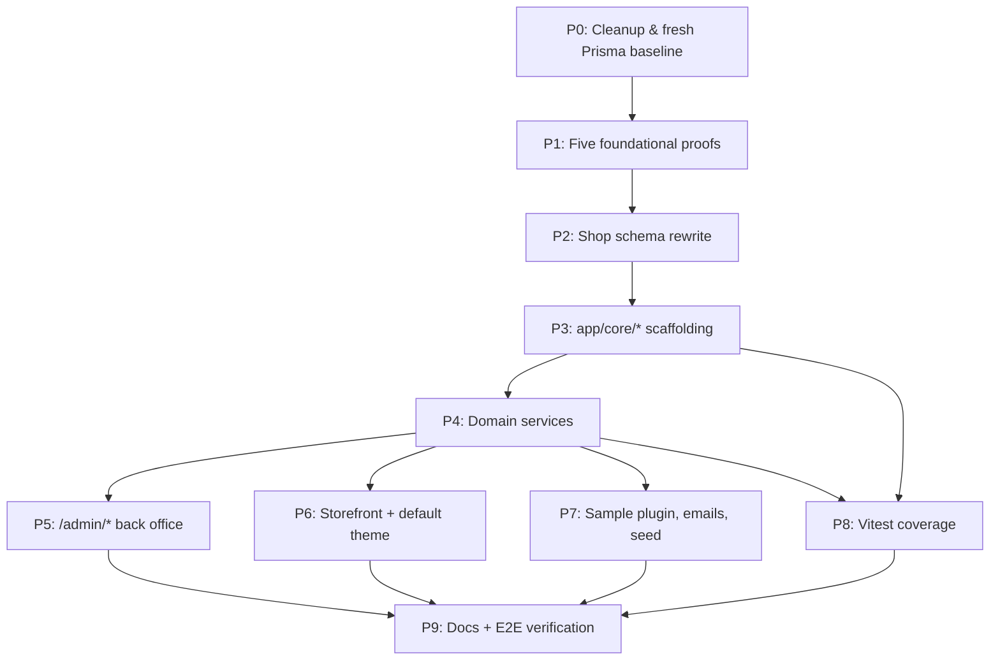

# bermooda — Phase 1 Implementation Plan

## Context

Build **bermooda**, an open-source ecommerce shop using React Router 7 SSR + Prisma 7/SQLite + better-auth + Tailwind 4 + LiteQuu + Resend + Pino + Docker/Node deploy, with manually configured S3-compatible storage. Single app serves both the storefront (themed) and admin back office. Designed for extensibility: third-party developers author **themes** (folder-based React components) and **plugins** (folder-based, hook-based, JSON storage). Public REST API is reserved at `/api/*` but deferred to a later phase. v1 adds multi-currency + i18n and a Vitest test suite.

**Tenancy:** single shop per install. **Admin/staff and customers are separate user models** (no shared accounts; isolated sessions). All keep-it-simple defaults: Stripe Checkout for v1 payment, flat-rate shipping, simple-percent tax — all pluggable via the provider API. **Default currency `USD`**, also-enabled-by-default `EUR` and `AUD`. **Locale is cookie-driven, never in URLs** — every storefront URL is locale-agnostic and the active locale comes from the `locale` cookie.

---

## Repo verification constraints

These are implementation constraints verified against this repository and must be handled before or during Phase 1:

- **Routes are static in [app/routes.js](../app/routes.js).** Route filenames are not auto-discovered. Theme/plugin route contribution must be implemented through static dispatcher routes or build-time route generation, not by changing React Router routes at runtime.
- **`app/core/*` is the new canonical ecommerce domain layer.** Rewrite the repo's agent rules and docs that currently point domain workflows at `app/services` so future work consistently uses `app/core/*` for shop engine code. Keep `app/libs/*` for low-level infrastructure clients.
- **Server-only modules must use `*.server.js`.** Provider adapters such as Stripe should be named `stripe.server.js`, not plain `stripe.js`.
- **Dual better-auth stacks are required.** The current app has one better-auth instance with `User`, `Session`, `Account`, `Verification`, `TwoFactor`, and the `organization()` plugin. Phase 1 splits this into an admin auth instance and a customer auth instance with separate base paths, cookie prefixes, models, clients, and route middleware.
- **Storage is manually configured.** Phase 1 must document manual S3-compatible storage setup and make the app read explicit env vars; do not rely on automated provisioning.
- **Testing and CI are new work.** The repo has no Vitest config/scripts today, and CI workflow stubs live under `.github/_workflows/`, not GitHub's runnable `.github/workflows/` path.

---

## High-level architecture

Three surfaces in one app:

- `/` — Storefront, rendered through the active theme.
- `/admin/*` — Admin back office, core-owned UI (not themed).
- `/api/*` — Reserved namespace; not implemented in v1.

**Folder layout (additions to existing `app/`):**

```
app/
  core/                  # The shop "engine" — domain logic, no UI; intentional replacement for SaaS app/services domain layer
    catalog/             # products, variants, categories, attributes, media
    cart/                # cart state, line items, totals, promotions
    checkout/            # checkout pipeline, validation, address, shipping, payment
    orders/              # order lifecycle, fulfillment, returns
    customers/           # customer profile, addresses, order history
    payments/            # provider registry + Stripe built-in adapter
    shipping/            # rate registry + flat-rate built-in adapter
    tax/                 # tax registry + simple-percent adapter
    settings/            # shop-wide settings (read-through TTL-cached)
    events/              # in-process lifecycle event bus
    plugins/             # plugin loader, registry, hook dispatcher
    themes/              # theme loader, active-theme resolver, slot system
    i18n/                # locale resolver, translation service, message catalogs
    currency/            # currency resolver, VariantPrice lookup, Intl formatting
    storage/             # media storage abstraction + S3-compatible adapter
  themes/
    default/             # bundled default theme
      manifest.js        # name, version, settings schema, links, locales
      routes.js          # optional route metadata consumed by static storefront dispatchers
      components/        # Layout, ProductCard, ProductPage, Cart, Checkout, ...
      i18n/<locale>.json # per-locale message catalogs
      assets/
  plugins/
    sample-analytics/    # bundled sample plugin, demonstrates the contract
      manifest.js
      index.server.js    # hook handlers
      admin/routes.js    # admin page descriptors consumed by static plugin dispatchers
      blocks/            # slot block components
      i18n/<locale>.json
  routes/
    admin/               # core back-office routes
      public/
        _layout.jsx      # public admin shell (login, forgot-password, verify-2fa)
      login.jsx
      forgot-password.jsx
      reset-password.jsx
      verify-2fa.jsx
      _layout.jsx        # protected shell — admin auth via RR7 route middleware
        dashboard.jsx
        products/...
        categories/...
        orders/...
        customers/...
        discounts/...
        themes.jsx
        plugins.jsx
        settings/...
        logout.jsx
    storefront/          # static storefront routes; loaders stay core-owned and render active theme components
      _layout.jsx        # delegates to active theme's Layout
      index.jsx
      products.$slug.jsx
      categories.$slug.jsx
      cart.jsx
      checkout.$step.jsx
      thank-you.$orderNumber.jsx
      account/...        # customer area (orders, addresses, profile)
      account/login.jsx, register.jsx, logout.jsx, forgot-password.jsx
    webhooks/
      $provider.jsx      # generic dispatcher → provider.verifyWebhook()
    api/                 # reserved (later phase)
  test/
    factories/           # test fixtures (User, Customer, Product, ...)
    helpers/             # db-per-worker setup, seed helpers
```

**Route wiring note:** the tree above is logical. Every public URL must still be added to [app/routes.js](../app/routes.js) with `index`, `layout`, `prefix`, and `route` from React Router's route config API.

**Layering rule:** routes call `app/core/*` services; themes only render UI; plugins extend through registered hooks/providers/blocks. Themes never import `app/core/*` directly — they consume a stable surface re-exported from `app/core/index.js`. `app/core/*` is the canonical home for ecommerce domain workflows. `app/services/*` is removed from the shop architecture except for temporary files during the first cleanup commit or future non-shop legacy integrations.

---

## Auth model (separate admin & customer)

- **`User`** — admin/staff only. Existing better-auth instance. Add `role: 'admin' | 'staff'` because current roles live on `Member.role`, which disappears when `Organization`/`Member` are removed. 2FA stays default-on. Drop SaaS-era customer-style fields.
- **`Customer`** — new model + parallel better-auth tables (`CustomerSession`, `CustomerAccount`, `CustomerVerification`; add `CustomerTwoFactor` if customer 2FA is enabled). Email/password + Google OAuth + email verification. 2FA optional.
- **Admin auth instance:** create `app/libs/auth/admin/index.server.js` from the current better-auth setup, remove the `organization()` plugin, keep admin 2FA, use a dedicated admin cookie prefix, and serve it under an admin auth base path such as `/admin/auth/*`.
- **Customer auth instance:** create `app/libs/auth/customer/index.server.js` with its own better-auth config, `Customer*` models, customer cookie prefix, customer redirect URLs, and customer auth base path such as `/account/auth/*`.
- **Adapter validation before schema rewrite:** prove better-auth 1.6.x + Prisma 7 can run the admin and customer auth instances against one Prisma client with the selected `Customer*` model-name configuration. The implementation direction remains two auth instances; if the Prisma adapter cannot support the selected names directly, add the smallest custom adapter or table-mapping shim needed to preserve the two-instance design.
- **No cross-table linkage.** Documented as intentional: a person who is both staff and customer holds two separate accounts.
- **Session isolation:** different cookie names and different auth API base paths so a staff member can be logged into both surfaces simultaneously. Keep the admin auth API separate from the customer account auth API; do not reuse the current single `/auth/*` route for both.
- **Auth surfaces:** `/admin/login` etc. for admins; `/account/login` etc. for customers.

---

## Data model (Prisma)

**Catalog**

- `Product` — `id`, `defaultSlug`, `status` (`draft`|`active`|`archived`), `requiresShipping`, `taxClassId?`, SEO fields, timestamps. Translatable fields (`title`, `description`, `metaTitle`, `metaDescription`) live in `Translation`; localized slugs live in `Slug` so uniqueness can be enforced.
- `ProductVariant` — `id`, `productId`, `sku` (unique), `inventoryQty`, `inventoryTracked`, `weightGrams?`, `optionValues` (JSON). **Price moved out** to `VariantPrice`.
- `VariantPrice` — `id`, `variantId`, `currency`, `priceCents`, `compareAtPriceCents?`. Unique on (`variantId`, `currency`). Default-currency row is required; non-default currency rows are optional for browsing only, not for checkout fallback.
- `ProductOption`, `ProductOptionValue` — option metadata.
- `Category` — `id`, `parentId?`, `position`, `defaultSlug`. Translatable fields in `Translation`; localized slugs in `Slug`.
- `ProductCategory` — join.
- `Media` — `id`, `url`, `storageKey?`, `altText?`, `mimeType`, `width?`, `height?`. `ProductMedia` join with `position`. v1 adds the storage abstraction around a manually configured storage client; this is not present in the template today.

**Customers**

- `Customer` — `id`, `email` (unique), `emailVerified`, `name?`, `phone?`, `marketingOptIn`, `preferredLocale?`, `preferredCurrency?`, timestamps.
- `CustomerSession`, `CustomerAccount`, `CustomerVerification`, `CustomerTwoFactor?` — better-auth tables (separate instance; include `CustomerTwoFactor` only if customer 2FA is enabled).
- `Address` — `id`, `customerId`, `type`, name/lines/city/region/postal/country/phone, `isDefault`.

**Cart & checkout**

- `Cart` — `id`, `token`, `customerId?`, `currency` (locked on first add), `locale`, `expiresAt`, timestamps.
- `CartLine` — `id`, `cartId`, `variantId`, `quantity`, `priceCentsSnapshot`, `titleSnapshot` (locale-resolved at add time). `priceCentsSnapshot` must be an exact price in `Cart.currency`; do not snapshot fallback USD cents into an EUR/AUD cart.
- `CheckoutSession` — `id`, `cartId`, `email`, `shippingAddressId?`, `billingAddressId?`, `shippingMethodId?`, `paymentProviderId?`, `status`, `expiresAt`.

**Orders**

- `Order` — `id`, `number` (sequential), `customerId?` (nullable for guest orders), `email`, `currency`, `locale`, totals (`subtotal`, `shipping`, `tax`, `discount`, `total`), `status`, `paymentStatus`, `fulfillmentStatus`, `paymentProvider`, `paymentRef?`, `createdAt`, `updatedAt`, **denormalized JSON snapshot** of shipping/billing addresses. (No separate `placedAt`: an `Order` row is only created on successful placement, so `createdAt` is the placement timestamp.)
- `OrderLine` — `id`, `orderId`, `variantId?`, `sku`, `title`, `quantity`, `unitPriceCents`, `lineTotalCents`, `taxCents`.
- `Shipment` — `id`, `orderId`, `carrier?`, `tracking?`, `status`, `shippedAt?`.
- `Refund` — `id`, `orderId`, `amountCents`, `reason?`, `providerRef?`, timestamps.

**Discounts**

- `Discount` — `id`, `code` (unique), `type` (`percent`|`fixed`), `value`, `appliesTo` (`order`|`shipping`), `minSubtotalCents?`, `startsAt?`, `endsAt?`, `maxUses?`, `usedCount`, `active`.

**Plugin & settings & misc**

- `PluginData` — `id`, `pluginId`, `key`, `value` (JSON string), timestamps. Unique on (`pluginId`, `key`).
- `Setting` — `id`, `key` (unique), `value` (JSON), `updatedAt`. Holds shop name, contact email, `defaultCurrency` (default `USD`), `currencies[]` (default `['USD','EUR','AUD']`), `defaultLocale` (default `en`), `locales[]`, `activeTheme`, theme settings, `enabledPlugins[]`, `pluginOrder[]`, tax mode (inclusive/exclusive), tax/shipping config.
- `Translation` — `id`, `entityType` (`product`|`category`|`page`), `entityId`, `locale`, `field`, `value`. Unique on (`entityType`, `entityId`, `locale`, `field`).
- `Slug` — `id`, `entityType` (`product`|`category`|`page`), `entityId`, `locale`, `value`. Unique on (`entityType`, `locale`, `value`) and (`entityType`, `entityId`, `locale`).
- `WebhookEvent` — `id`, `provider`, `eventId`, `receivedAt`. Unique on (`provider`, `eventId`). Used for webhook idempotency.

---

## Multi-currency

- Currencies enabled in `Setting.currencies` (default `['USD','EUR','AUD']`); `defaultCurrency` is `USD`.
- Per-variant prices live in `VariantPrice` rows; default-currency (USD) row required, others optional.
- Missing active-currency price may fall back to default currency **only for non-cart browsing display**, and the UI must label the displayed currency honestly. Add-to-cart and checkout require an exact `VariantPrice` row in `Cart.currency`; otherwise show a clear unavailable-in-currency error or ask the customer to switch currency.
- Active currency resolution: explicit `currency` cookie / customer preference → plugin-set hint (geo) → `defaultCurrency`.
- `Cart.currency` locked on first add-to-cart; cart switch requires clearing.
- No FX/auto-conversion in core — manual prices per currency. FX provider via plugin.
- Exposed to themes through `useShop().currency` and `formatPrice(cents, currency?)` (uses `Intl.NumberFormat`).

---

## i18n

- Locales enabled in `Setting.locales` (e.g. `['en','de','fr']`); `defaultLocale` is `en`.
- Translatable content lives in `Translation`. Untranslated fields fall back to default locale.
- **No locale in URL.** Locale is selected on every request from a `locale` cookie. Storefront URLs are locale-agnostic (e.g. `/products/black-tee`). When the cookie is absent, the resolver picks a locale and sets the cookie on the response.
- Active locale resolution chain: `locale` cookie → authenticated customer's `preferredLocale` → `Accept-Language` (negotiated against `Setting.locales`) → `defaultLocale`. Result is set on the response cookie so subsequent requests are stable.
- Locale switcher (storefront and admin) writes to the `locale` cookie, then triggers a revalidation; backend always reads locale from the cookie via a `getRequestLocale(request)` helper.
- Slugs are translatable per locale via `Slug`; the same product's URL is therefore the same string regardless of UI locale unless the admin authors a translated slug. Slug uniqueness is enforced by `Slug` per (`entityType`, `locale`, `value`).
- UI strings: lightweight in-house resolver in `app/core/i18n/`. Catalogs at `app/core/i18n/messages/<locale>.json`, `app/themes/<name>/i18n/<locale>.json`, `app/plugins/<name>/i18n/<locale>.json`. Plugin/theme manifests declare a `locales` array; catalogs auto-discovered.
- Theme + plugin code uses `useT()`; admin UI also runs through `useT()`. Number/currency/date formatting via `Intl`.

---

## Storage

- Media storage is configured manually by the operator, not automatically provisioned by the app.
- Add `app/core/storage/` with a small server-only client wrapper that reads explicit env vars for endpoint, region, bucket, access key, secret key, and public URL/base URL.
- Keep the app-side interface provider-neutral for any S3-compatible service (AWS S3, MinIO, Cloudflare R2, etc.).
- Update `.env.example` and `docs/storage.md` with exact manual setup steps, required env vars, local-development behavior, and failure modes.
- Admin media upload UI talks only to `app/core/storage/*`; no route or admin component imports a storage SDK directly.

---

## Theme contract

A theme is a folder in `app/themes/<name>/`.

- **Manifest** — `name`, `version`, `author`, `settings` schema (rendered as a form on `/admin/themes`), `links` (assets pulled into `<head>`), `locales`.
- **Routes** — React Router routes remain static in [app/routes.js](../app/routes.js). Theme `routes.js` may declare component mappings and optional page metadata consumed by the core storefront route modules; it cannot add arbitrary runtime URLs in v1. Loader stays core-owned; component is theme-owned.
- **Required components** — `Layout`, `HomePage`, `ProductCard`, `ProductGrid`, `ProductPage`, `CategoryPage`, `CartPage`, `CheckoutLayout` + step components, `CheckoutThankYouPage`, `AccountLayout` + account pages, `LoginPage`, `RegisterPage`, `ForgotPasswordPage`, `NotFoundPage`. Validated by `defineTheme()` at build time; missing components fail fast.
- **Slots** — `<Slot name="home.hero" />`, `<Slot name="product.afterDescription" />`, etc. Plugins register block components into slots via manifest. v1 ships ~10 well-known slot names; no block-builder UI in v1.
- **Data access** — themes consume loader data + `useShop()` + `useT()`. They never import `app/core/*` internals directly — only the public surface re-exported from `app/core/index.js`.
- **Active theme resolution** — `Setting.activeTheme` (TTL-cached). Switching among source-bundled themes requires no rebuild. Do not tree-shake inactive themes in v1 unless theme selection becomes build-time only; runtime no-rebuild switching and inactive-theme tree-shaking are conflicting goals.
- **Hot-reload** works in dev because themes are source files.
- **Dev guide** — `docs/themes.md` covers contract, slot list, helper hooks, fork-the-default walkthrough.

---

## Plugin contract

A plugin is a folder in `app/plugins/<name>/`.

- **Manifest** — `name`, `version`, `displayName`, `description`, `settings` schema (form rendered on `/admin/plugins/<name>`), `contributes` (declarative: `adminRoutes`, `storefrontRoutes`, `blocks[]`, `paymentProviders[]`, `shippingProviders[]`, `taxProviders[]`), `locales`.
- **Server entry** — `index.server.js` exports `defineHooks({ 'order.created': fn, ... })`. Hook handlers receive `{ ...payload, ctx }` where `ctx = { db, settings, plugin: { get, set, delete }, logger, queue, emit, t }`. Plugin data flows through `ctx.plugin.*` → `PluginData` namespaced by `pluginId`.
- **Lifecycle events emitted by core (v1):** `cart.created`, `cart.updated`, `cart.itemAdded`, `cart.itemRemoved`, `checkout.started`, `checkout.completed`, `order.created`, `order.cancelled`, `order.fulfilled`, `order.refunded`, `payment.authorized`, `payment.completed`, `payment.failed`, `payment.refunded`, `customer.registered`, `customer.loggedIn`, `product.viewed`, `product.created`, `product.updated`, `product.deleted`. Hooks awaited in registration order; only checkout-critical paths propagate errors, otherwise errors are caught + logged.
- **Provider registration** — `defineProvider('payment'|'shipping'|'tax', spec)`. Built-in Stripe/flat-rate/simple-percent register via the same API (no privileged path).
- **Admin route contribution** — `app/plugins/<name>/admin/routes.js` exports page descriptors rendered by a static `/admin/plugins/:pluginId/*` dispatcher route. Plugins cannot mutate [app/routes.js](../app/routes.js) at runtime.
- **Storefront route contribution** — `app/plugins/<name>/storefront/routes.js` exports page descriptors rendered by a static `/apps/:pluginId/*` dispatcher route.
- **Block contribution** — for each declared slot, plugin exports `app/plugins/<name>/blocks/<slot-name>.jsx`. Render order from `Setting.pluginOrder`.
- **Lifecycle** — `enable`/`disable` toggle in `Setting.enabledPlugins`. Optional `onEnable`/`onDisable` exports run on toggle. Folders are the source of truth; data persists across disable/enable.
- **Sample plugin** — `app/plugins/sample-analytics/` ships in v1: `order.created` hook, admin page with recent events, `product.afterDescription` block, reads/writes `PluginData`. Canonical reference.
- **Dev guide** — `docs/plugins.md`.

---

## Payment / shipping / tax flow

**Checkout pipeline** — 4-step state machine on `CheckoutSession`:

1. **Address** — collect shipping + billing addresses, capture email.
2. **Shipping** — query enabled shipping providers for rates given cart + address; customer selects.
3. **Payment** — query enabled payment providers; customer selects. Provider's `startPayment()` returns redirect URL or client-side handoff.
4. **Review** — server re-computes totals, customer confirms, payment initiated. On success: `Order` row created, cart cleared, `order.created` fires.

Step routes: `/checkout/address`, `/checkout/shipping`, `/checkout/payment`, `/checkout/review`, `/thank-you/:orderNumber`.

**Totals engine** (`app/core/checkout/totals.server.js`):

```
subtotal = sum(line.unitPrice * line.qty)   # exact VariantPrice row for cart.currency
discount = applyDiscounts(subtotal, codes)
shipping = activeShippingProvider.quote(...)
tax      = activeTaxProvider.compute(subtotal - discount, shippingAddress)
total    = subtotal - discount + shipping + tax
```

Computed on every cart mutation, every checkout step, and re-run server-side at order placement. Result snapshotted onto `Order`.

**Built-in providers**

- **Payment — Stripe** (default: Stripe Checkout, hosted; Elements available later). This is a rewrite of the current subscription-oriented `app/services/stripe.server.js`, not a rename. Use dynamic Checkout line items / `price_data`, order or checkout metadata, signature verification, idempotency via (`provider`, `eventId`), refunds, and Pino logging.
- **Shipping — flat-rate** (per region in admin: free over X supported).
- **Tax — simple-percent** (per country/region; tax-inclusive vs exclusive shop-wide setting).

**Inventory** — atomic decrement at order creation; `inventoryTracked=false` skipped; `INSUFFICIENT_INVENTORY` failure sends customer back to cart. No reservations in v1.

**Refunds** — admin "Refund" button (full or partial) routes through provider's `refund()`; `Refund` row recorded; `payment.refunded` fires.

**Webhook receiver** — `routes/webhooks/$provider.jsx` resolves provider from registry and calls `verifyWebhook()`. Plugin payment providers share this static dispatcher route; they do not register their own React Router modules at runtime.

---

## Admin back office

`/admin/*` is built once in core (Tailwind + Headless UI, both already in repo). Not themed.

- **Sidebar:** Dashboard, Orders, Products, Categories, Customers, Discounts, Themes, Plugins, Settings.
- **Topbar:** search, current admin user, theme/dark-mode toggle, **locale switcher** (admin UI runs through `useT()`).
- **Pages:**
  - **Dashboard** — KPI tiles + recent orders + plugin-contributed widgets via `dashboard.widgets` slot.
  - **Orders** — list/filter, detail (line items, payment events, fulfillment, refund, manual notes).
  - **Products** — list + create/edit (translatable fields with locale tabs, options, variants editor, **per-currency price grid**, media uploader through the manually configured storage client, categories, SEO).
  - **Categories** — tree editor with drag-to-reorder, locale tabs for translatable fields.
  - **Customers** — list/search, detail (addresses, order history), manual create.
  - **Discounts** — CRUD.
  - **Themes** — list, current selection, manifest-driven settings form, preview link.
  - **Plugins** — list, enable/disable, drag-to-reorder, manifest-driven settings form, link to plugin admin pages.
  - **Settings** — Shop name, contact email, currencies + default (USD/EUR/AUD shipped enabled by default, USD default), locales + default, tax mode, tax regions, shipping zones, admin user CRUD, email templates.
- **Auth gate:** RR7 route middleware (already enabled via `future.v8_middleware: true` in [react-router.config.js](../react-router.config.js)) attached to the admin `_layout.jsx`. The middleware reads the admin session cookie and redirects to `/admin/login` on failure — loaders no longer need per-handler `requireAdmin()` calls. The `account/*` tree uses the same pattern with the customer session cookie. Staff and admin equal access in v1; granular permissions deferred.
- **Email templates** — order confirmation, password reset (admin & customer), customer welcome, abandoned cart (basic). React Email in `app/emails/shop/`. Triggered via existing `app/emails/job.server.js` queue. Translatable per locale.

---

## Testing (Vitest)

**Setup**

- Add `vitest`, `@vitest/coverage-v8`, `@testing-library/react`, `@testing-library/jest-dom`, `happy-dom`, `supertest` to devDependencies.
- Scripts: `"test": "vitest run"`, `"test:watch": "vitest"`, `"test:coverage": "vitest run --coverage"`.
- `vitest.config.js` with two projects: `unit` (happy-dom env) and `server` (node env). `#/*` alias mirrored from `vite.config.js`. Coverage thresholds **80% for `app/core/**`\*\*.
- Test fixtures: in-memory SQLite per worker via `@prisma/adapter-better-sqlite3`. `vitest-setup.js` runs `prisma migrate deploy` against a tmp file once per worker; truncates between tests. Factory helpers in `app/test/factories/`.
- CI: create `.github/workflows/` entries to run `npm run test:coverage`, `npm run lint`, and `npm run build` on PRs.

**Coverage targets (v1 must-haves):**

1. **Totals engine** — subtotal, discount, shipping, tax, exact cart-currency price resolution, browsing-only currency fallback, tax-inclusive vs exclusive, edge cases.
2. **Cart service** — add/remove/update line, currency lock on first add, snapshot pricing, expiry, guest→customer cart merge on login.
3. **Checkout pipeline** — step transitions, validation, server-side recompute, idempotent order creation, inventory decrement (incl. INSUFFICIENT_INVENTORY race-loss).
4. **Order service** — create from checkout, status transitions, refund flow, fulfillment.
5. **Plugin loader** — manifest validation, hook registration, dispatch order, error isolation, `ctx.plugin.*` namespacing, enable/disable lifecycle.
6. **Theme resolver** — active resolution, manifest validation, component mapping precedence, fallback to core defaults, missing-component fail-fast.
7. **Provider registry** — register/lookup, no-privileged-path-for-built-ins assertion, `defineProvider` validation.
8. **i18n resolver** — locale resolution chain, fallback, missing-key behavior, plugin/theme catalog merging.
9. **Translation service** — read with fallback, write per locale, `Slug` uniqueness per locale/entity type.
10. **Currency service** — active currency resolution, exact checkout `VariantPrice` lookup, browsing-only fallback behavior, `Intl` formatting per locale.
11. **Stripe payment adapter** — `startPayment` shape, webhook signature verification (mocked), idempotent replay, refund flow.
12. **Webhook idempotency** — `WebhookEvent` replay-skip behavior.
13. **Discount engine** — percent vs fixed, min subtotal, expiry, max-uses.
14. **Inventory** — atomic decrement, race condition, `inventoryTracked=false` skip.
15. **Auth boundaries** — admin/customer route middleware redirects, customer-vs-admin session isolation, dual auth API base paths, guest cart token rotation on login.
16. **Sample plugin** — integration test exercising the plugin contract end-to-end via `order.created`.
17. **Default theme** — smoke test that all required components render with mock loader data.

`docs/testing.md` documents conventions: `.test.js` (unit), `.test.server.js` (server), factories pattern, db-per-worker pattern.

---

## Removals & cleanup from existing template (first commit)

**Schema ([prisma/schema.prisma](../prisma/schema.prisma))**

- Drop the `Organization`, `Member`, `Invitation`, `Subscription` models.
- Drop the `Session.activeOrganizationId` column (added by the better-auth `organization` plugin; orphaned once the plugin is removed).
- Replace existing migrations with a fresh initial migration.

**Subscription / billing cascade** (knock-on from dropping `Subscription`)

- [app/services/stripe.server.js](../app/services/stripe.server.js) — **rewrite** (not just move) into `app/core/payments/stripe.server.js`: drop the subscription `checkout.session` helper and `customer.subscription.*` event handling; keep only one-time-payment Stripe Checkout + signature verification.
- [app/routes/webhooks/stripe.jsx](../app/routes/webhooks/stripe.jsx) — drop the existing subscription event handlers; the Stripe webhook now flows through the generic `routes/webhooks/$provider.jsx` dispatcher.
- [app/components/landing/hero.jsx](../app/components/landing/hero.jsx) — remove the `/checkout/polar?...` CTA link.
- [app/config.js](../app/config.js) — drop the `polar.plans` block.

**Polar removal**

- [app/services/polar.server.js](../app/services/polar.server.js) — drop.
- [app/routes/checkout/polar.jsx](../app/routes/checkout/polar.jsx), [app/routes/webhooks/polar.jsx](../app/routes/webhooks/polar.jsx) — drop.
- `@polar-sh/remix` dependency — remove from [package.json](../package.json).

**SaaS / organization scaffolding**

- [app/routes/app/\*](../app/routes/app/) — drop (`_layout.jsx`, `dashboard.jsx`, `organization.jsx`, `settings.jsx`, `support.jsx`); replaced by `app/routes/admin/*`.
- [app/routes/organization/accept-invitation.jsx](../app/routes/organization/accept-invitation.jsx) — drop (the only file under `routes/organization/`).
- [app/libs/auth/index.server.js](../app/libs/auth/index.server.js) — remove the better-auth `organization` plugin import + config block (the client-side `organizationClient` plugin import in `app/libs/auth/client.js` goes too).

**Agent rules / architecture docs**

- [.cursor/rules/general.mdc](../.cursor/rules/general.mdc), [.cursor/rules/react-router/routes.mdc](../.cursor/rules/react-router/routes.mdc), [.cursor/rules/libs-core.mdc](../.cursor/rules/libs-core.mdc), [.cursor/rules/ecommerce-architecture.mdc](../.cursor/rules/ecommerce-architecture.mdc), [.cursor/rules/components.mdc](../.cursor/rules/components.mdc), [.cursor/rules/utils-hooks.mdc](../.cursor/rules/utils-hooks.mdc), [CLAUDE.md](../CLAUDE.md), and any other local rule that said domain workflows belong in `app/services` — rewritten to say ecommerce domain workflows belong in `app/core/*`; `app/libs/*` remains infrastructure and SDK clients. (Former `libs-services.mdc` renamed to `libs-core.mdc`.)
- [AGENTS.md](../AGENTS.md) — note added that shop engine code lives in `app/core/*` and agents should not introduce new ecommerce workflows under `app/services/*`.

**Polish (drive-bys with the same first commit)**

- [app/utils/logger.server.js](../app/utils/logger.server.js) — change the default Pino `name` from the stale `easyedit-order-editing` to `bermooda`.
- [README.md](../README.md) — fix the dev URL from `http://localhost:5173` to `http://localhost:3000`.

**Kept:** better-auth, Resend + React Email, LiteQuu, Pino, `@isaacs/ttlcache` (used for the `Setting` cache via [app/utils/cache/index.server.js](../app/utils/cache/index.server.js)), Telegram, Tailwind, Headless UI, Heroicons, oxlint/oxfmt, manually configured S3-compatible storage, Docker.

---

## Execution plan

The 10 phases below are the execution path through the spec above. Each phase lists parallel vs sequential tasks, owned file paths, and a validation gate so subagents can be dispatched per task.

### How to use with subagents

- **Sequential phases:** dispatch only after the prior phase's exit criteria pass.
- **Parallel tasks within a phase:** each task lists the files it owns; do not dispatch two tasks that write the same file in parallel.
- **Serialization points** (shared files): P0-5, P2-6, P3-2, P4-C/D, P6-1 land alone because they touch [prisma/schema.prisma](../prisma/schema.prisma) or [app/routes.js](../app/routes.js). An "assembler" subagent merges drafts if multiple engineers drafted in parallel.
- **Validation gates:** each phase ends with `npm run lint` + `npm run build` + the targeted tests for that phase. Do not advance until green.

### Dependency graph



### Phase 0 — Cleanup & fresh Prisma baseline

**Goal.** Remove SaaS/org/Polar scaffolding; rewrite agent rules; land a fresh Prisma baseline with SaaS models dropped and `User.role` added.
**Depends on:** —
**Exit gate:** `npm run lint` clean; `npm run build` clean; `npm run setup` works on a fresh DB; no references remain to `Organization`, `Member`, `Invitation`, `Subscription`, or Polar.

Tasks P0-1..P0-4 are parallel. P0-5 runs last because P0-2 and P0-3 remove the callers of the models P0-5 drops.

- **P0-1. Rewrite architecture rules (parallel). Done.** Owns [.cursor/rules/general.mdc](../.cursor/rules/general.mdc), [.cursor/rules/libs-core.mdc](../.cursor/rules/libs-core.mdc) (renamed from `libs-services.mdc`), [.cursor/rules/ecommerce-architecture.mdc](../.cursor/rules/ecommerce-architecture.mdc), [.cursor/rules/react-router/routes.mdc](../.cursor/rules/react-router/routes.mdc), [.cursor/rules/components.mdc](../.cursor/rules/components.mdc), [.cursor/rules/utils-hooks.mdc](../.cursor/rules/utils-hooks.mdc), [CLAUDE.md](../CLAUDE.md), [AGENTS.md](../AGENTS.md), [docs/auth.md](./auth.md). Replaced `app/services/*` guidance with `app/core/*` as the domain layer; kept `app/libs/*` as infrastructure.
- **P0-2. Drop SaaS/org routes + services (parallel).** Delete `app/routes/app/` (all files), `app/routes/organization/accept-invitation.jsx`, `app/routes/checkout/polar.jsx`, `app/routes/webhooks/polar.jsx`, `app/services/polar.server.js`. Remove the corresponding entries from [app/routes.js](../app/routes.js).
- **P0-3. Drop Polar + org from config/auth/landing (parallel).** Remove `@polar-sh/remix` from [package.json](../package.json); drop `polar.plans` from [app/config.js](../app/config.js); strip the `/checkout/polar` CTA from [app/components/landing/hero.jsx](../app/components/landing/hero.jsx); remove the `organization` plugin block from [app/libs/auth/index.server.js](../app/libs/auth/index.server.js) and the `organizationClient` import from [app/libs/auth/client.js](../app/libs/auth/client.js).
- **P0-4. Polish drive-bys (parallel).** In [app/utils/logger.server.js](../app/utils/logger.server.js) set Pino `name` to `bermooda`. In [README.md](../README.md) change dev URL `5173` → `3000`.
- **P0-5. Fresh Prisma baseline (last).** In [prisma/schema.prisma](../prisma/schema.prisma) drop `Organization`, `Member`, `Invitation`, `Subscription`, `Session.activeOrganizationId`; add `role Role` on `User` with enum `Role { admin, staff }`. Wipe [prisma/migrations/](../prisma/migrations/) and regenerate a single `0000_init` migration.

### Phase 1 — Five foundational proofs

**Goal.** De-risk the architecture decisions that block the main build. All five tasks are independent and parallel.
**Depends on:** Phase 0.
**Exit gate:** each proof has a smoke test recorded in its docs file; CI green for lint + build.

- **P1-A. Dual better-auth instances.** Create [app/libs/auth/admin/index.server.js](../app/libs/auth/admin/index.server.js) (from current `index.server.js`: drop `organization`, cookie prefix `bermooda_admin_`, `baseURL` path `/admin/auth/*`, keep `twoFactor`). Create [app/libs/auth/customer/index.server.js](../app/libs/auth/customer/index.server.js) with a separate `betterAuth()` instance using the `Customer*` models via `prismaAdapter` schema mapping, cookie prefix `bermooda_customer_`, base path `/account/auth/*`. Add [app/libs/auth/admin-client.js](../app/libs/auth/admin-client.js) and [app/libs/auth/customer-client.js](../app/libs/auth/customer-client.js). Prove coexistence on one Prisma client; if the Prisma 7 adapter cannot map `Customer*` directly, ship the smallest table-mapping shim. Smoke: staff + customer logged in simultaneously with two cookies. Record mapping + smoke in [docs/auth.md](./auth.md).
- **P1-B. Static dispatcher routing proof.** Add skeleton `app/core/plugins/index.server.js` with `loadPlugins()` and `resolvePluginRoute(id, path)`. Add skeleton `app/core/themes/index.server.js` with `resolveActiveTheme()` + `getStorefrontComponent(name)`. Wire `/apps/:pluginId/*` as a static dispatcher in [app/routes.js](../app/routes.js) rendering the resolved descriptor, and add one storefront route that delegates rendering to a theme component. Confirm no path mutates routes at runtime.
- **P1-C. Storage client API.** Create `app/core/storage/client/index.server.js` with an S3-compatible wrapper reading `STORAGE_ENDPOINT`, `STORAGE_REGION`, `STORAGE_BUCKET`, `STORAGE_ACCESS_KEY`, `STORAGE_SECRET_KEY`, `STORAGE_PUBLIC_URL`. Expose `putObject`, `getObjectUrl`, `deleteObject`. Add vars to [.env.example](../.env.example). Write [docs/storage.md](./storage.md) with setup steps, local-dev behavior, failure modes.
- **P1-D. CI workflows.** Create `.github/workflows/ci.yml` with `lint` and `build` jobs (test job added in Phase 8).
- **P1-E. Vitest skeleton.** Add `vitest`, `@vitest/coverage-v8`, `@testing-library/react`, `@testing-library/jest-dom`, `happy-dom`, `supertest`. Create `vitest.config.js` (unit + server projects, `#` alias, non-enforcing coverage threshold `{'app/core/**': 80}`). Scripts: `test`, `test:watch`, `test:coverage`. Add one smoke test so CI has something to run.

### Phase 2 — Shop schema rewrite

**Goal.** Land the full ecommerce Prisma schema in a single migration on top of the Phase 0 baseline.
**Depends on:** Phase 0 (baseline), P1-A (customer model names).
**Exit gate:** `prisma validate` clean; `prisma migrate reset` + `npm run setup` clean; `prisma generate` updates [prisma/generated/](../prisma/generated/); unique indices on `Slug`, `Translation`, `VariantPrice`, `PluginData`, `WebhookEvent` enforced.

P2-1..P2-5 are parallel drafting; P2-6 is the single assembler.

- **P2-1. Catalog models.** `Product`, `ProductVariant` (no price), `VariantPrice` (`@@unique([variantId, currency])`), `ProductOption`, `ProductOptionValue`, `Category`, `ProductCategory`, `Media`, `ProductMedia`.
- **P2-2. Customer + address models.** `Customer`, `CustomerSession`, `CustomerAccount`, `CustomerVerification`, optional `CustomerTwoFactor`, `Address` — matching P1-A decisions.
- **P2-3. Cart + checkout + orders.** `Cart`, `CartLine` (with `priceCentsSnapshot`, `titleSnapshot`), `CheckoutSession`, `Order` (denormalized address JSON, `createdAt` is placement), `OrderLine`, `Shipment`, `Refund`.
- **P2-4. Misc models.** `Discount`, `PluginData` (`@@unique([pluginId, key])`), `Setting` (unique `key`), `Translation` (`@@unique([entityType, entityId, locale, field])`), `Slug` (two unique indices), `WebhookEvent` (`@@unique([provider, eventId])`).
- **P2-5. User role confirmation.** Verify `User.role` is the only SaaS-era field change; no stray columns remain.
- **P2-6. Assemble + migrate (last).** Merge drafts into [prisma/schema.prisma](../prisma/schema.prisma), run `npx prisma format`, `npm run prisma:migrate -- --name initial-shop`, commit schema + migration + generated client together.

### Phase 3 — `app/core/*` scaffolding

**Goal.** Build the shop engine — no UI — as the stable surface admin and storefront consume.
**Depends on:** Phase 2.
**Exit gate:** every module exports the functions its consumers will call; `app/core/index.js` re-exports the theme/plugin surface with no circular imports; no `app/core/*` module imports from `app/routes/*`; P3-6..P3-8 unit tests pass.

**Tier 1 (sequential foundation).**

- **P3-1. Scaffold directories.** Create empty modules under `app/core/{catalog,cart,checkout,orders,customers,payments,shipping,tax,settings,events,plugins,themes,i18n,currency,storage}`. Each exports a named object even if the body is a TODO.
- **P3-2. Public surface.** Create `app/core/index.js` re-exporting `useShop`, `useT`, `formatPrice`, `<Slot />`, selectors, and DTOs. Internals remain unexported.
- **P3-3. Event bus.** `app/core/events/index.server.js` — `emit(event, payload)`, `on(event, handler)`, registration-order dispatch, error isolation for non-checkout-critical paths.

**Tier 2 (parallel after Tier 1).**

- **P3-4. Plugin loader.** Manifest validation; `defineHooks()` and `defineProvider('payment'|'shipping'|'tax', spec)`; hook dispatcher awaited in registration order; `ctx = { db, settings, plugin: { get, set, delete }, logger, queue, emit, t }`; `PluginData` namespaced by `pluginId`; `enable`/`disable` lifecycle + optional `onEnable`/`onDisable`.
- **P3-5. Theme loader.** `defineTheme()` with build-time required-component validation; active theme resolver (TTL-cached via `Setting.activeTheme`); `<Slot />` with ~10 well-known slot names; block order from `Setting.pluginOrder`.
- **P3-6. Settings service.** `get(key)`, `set(key, value)` read-through TTL-cached via [app/utils/cache/index.server.js](../app/utils/cache/index.server.js). Seed defaults: `defaultCurrency=USD`, `currencies=['USD','EUR','AUD']`, `defaultLocale=en`, `activeTheme=default`.

**Tier 3 (parallel after Tier 2 — depend on Settings).**

- **P3-7. i18n resolver.** `getRequestLocale(request)` with resolution chain `locale` cookie → customer `preferredLocale` → `Accept-Language` negotiation → `defaultLocale`; `useT()` + server `t(key, params)`; catalog merging across `app/core/i18n/messages/`, `app/themes/<name>/i18n/`, `app/plugins/<name>/i18n/`; write-through cookie on resolution.
- **P3-8. Currency service.** `getRequestCurrency(request)`; `lookupVariantPrice(variantId, currency)` exact match for cart/checkout; `lookupVariantPriceForBrowsing(variantId, currency)` with default-currency fallback + `isFallback` flag; `formatPrice(cents, currency?, locale?)` via `Intl.NumberFormat`.
- **P3-9. Storage finalize.** Promote the P1-C prototype into `app/core/storage/index.server.js`; add `uploadMedia(file)` returning `{ url, storageKey, mimeType, width, height }`.

### Phase 4 — Domain services

**Goal.** Business workflows that use the core scaffolding.
**Depends on:** Phase 3.
**Exit gate:** totals, cart, discount, inventory, provider registry services callable from scripts; Stripe adapter verifies a mocked webhook; Tier-2 services compile and are reachable from routes.

**Tier 1 (parallel).**

- **P4-A. Catalog service** — `app/core/catalog/*`: product/variant/category CRUD for admin, slug resolution via `Slug`, media association. Reads `VariantPrice` rows per currency.
- **P4-B. Cart service** — `app/core/cart/*`: `addLine`, `removeLine`, `updateQuantity`; currency lock on first add; `priceCentsSnapshot` + `titleSnapshot` at add-time (locale-resolved); expiry; guest→customer merge on login with token rotation.
- **P4-E. Payment registry + Stripe adapter** — `app/core/payments/*` and `app/core/payments/stripe.server.js`. **Rewrite** of [app/services/stripe.server.js](../app/services/stripe.server.js) (not a move): drop subscription `checkout.session` helper + `customer.subscription.*`; keep one-time Stripe Checkout with dynamic `price_data`, signature verification, idempotency on `(provider, eventId)`, refunds, Pino logging.
- **P4-F. Shipping registry + flat-rate adapter** — `app/core/shipping/*`: per-region flat rates, free-over-X, config in `Setting`.
- **P4-G. Tax registry + simple-percent adapter** — `app/core/tax/*`: per country/region percent, shop-wide `tax.mode = inclusive | exclusive`.
- **P4-H. Inventory.** Atomic decrement inside a transaction; `inventoryTracked=false` skip; `INSUFFICIENT_INVENTORY` error.
- **P4-I. Discount engine** — percent vs fixed, min subtotal, expiry, max-uses with atomic `usedCount++`.
- **P4-J. Customer service** — profile, address book, order history; bridges to the customer auth instance from P1-A.

**Tier 2 (sequential after Tier 1).**

- **P4-C. Totals + checkout pipeline** — `app/core/checkout/totals.server.js` (formula from spec) and `app/core/checkout/pipeline.server.js` 4-step state machine on `CheckoutSession` (address → shipping → payment → review). Server re-computes on every mutation and at placement.
- **P4-D. Order service** — `app/core/orders/*`: transactional `placeOrder()` (decrement inventory, snapshot addresses, create `OrderLine`s, clear cart, emit `order.created`); status transitions; refund flow emits `payment.refunded`; `Shipment` fulfillment.
- **P4-K. Webhook dispatcher** — new `app/routes/webhooks/$provider.jsx` generic route: resolves provider from registry, calls `verifyWebhook()`, writes to `WebhookEvent` (skip on duplicate), emits `payment.*` events. Delete the old `app/routes/webhooks/stripe.jsx` and wire Stripe through the dispatcher.

### Phase 5 — `/admin/*` back office

**Goal.** Core-owned admin UI against Phase 4 services.
**Depends on:** Phase 4. **Parallel with:** Phase 6, Phase 7.
**Exit gate:** admin seed user can log in, CRUD a product with translations + multi-currency prices + media, build a category tree, place a manual order, issue a refund, toggle a plugin, switch a theme, edit settings.

- **P5-1. Admin shell (first).** Create `app/routes/admin/public/_layout.jsx` with `login`, `forgot-password`, `reset-password`, `verify-2fa`, `logout`. Create `app/routes/admin/_layout.jsx` with RR7 route middleware calling into `admin.server.js`; redirect `/admin/login` on failure. Build sidebar + topbar (search, admin user menu, dark-mode toggle, locale switcher via `useT()`). Add all routes to [app/routes.js](../app/routes.js).

Parallel after P5-1:

- **P5-2. Dashboard** — KPI tiles (orders, revenue, abandoned checkouts, low-stock), recent orders, `dashboard.widgets` slot.
- **P5-3. Products admin** — list + editor with locale tabs, options + variants editor, **per-currency price grid** writing `VariantPrice`, media uploader → `app/core/storage`, category picker, SEO.
- **P5-4. Categories admin** — tree editor with drag-to-reorder (`position`), locale tabs, localized `Slug`.
- **P5-5. Orders admin** — list/filter, detail (line items, payment events, fulfillment, refund button, manual notes).
- **P5-6. Customers admin** — list/search, detail (addresses, order history), manual create.
- **P5-7. Discounts admin** — CRUD.
- **P5-8. Themes admin** — list from `app/themes/`, selection, manifest-driven settings form, storefront preview link.
- **P5-9. Plugins admin** — list from `app/plugins/`, enable/disable, drag-to-reorder (`Setting.pluginOrder`), manifest-driven settings form, link to plugin admin pages.
- **P5-10. Settings admin** — shop name, contact email, currencies + default (USD/EUR/AUD seeded enabled, USD default), locales + default, tax mode, tax regions, shipping zones, admin user CRUD, email templates preview.
- **P5-11. Plugin admin dispatcher** — static `/admin/plugins/:pluginId/*` route resolving descriptors from the plugin's `admin/routes.js`.

### Phase 6 — Storefront + default theme + customer auth UI

**Goal.** Themed, cookie-locale storefront with full shopping flow and customer account area.
**Depends on:** Phase 4. **Parallel with:** Phase 5, Phase 7.
**Exit gate:** guest can browse → add-to-cart → 4-step checkout → Stripe test payment → order confirmation; locale + currency switchers persist via cookies; customer can register, log in, view orders, manage addresses.

- **P6-1. Storefront routes (first).** Extend [app/routes.js](../app/routes.js) with `/`, `/products/:slug`, `/categories/:slug`, `/cart`, `/checkout/:step`, `/thank-you/:orderNumber`, `/account/*` + `/account/login|register|forgot-password|reset-password|logout`, `/apps/:pluginId/*`. Loaders live in `app/routes/storefront/*` and call `app/core/*`.
- **P6-2. Default theme skeleton (first).** `app/themes/default/manifest.js`, `routes.js` (component mappings), `i18n/en.json`, and stubs for every required component.

Parallel after P6-1 + P6-2:

- **P6-3. Core theme components** — `Layout`, `HomePage`, `ProductCard`, `ProductGrid`, `NotFoundPage`.
- **P6-4. Product + category pages** — `ProductPage` (with `product.afterDescription` slot), `CategoryPage`.
- **P6-5. Cart page** — line editor, totals, currency-mismatch warnings.
- **P6-6. Checkout UI** — `CheckoutLayout`, step components (Address, Shipping, Payment, Review), `CheckoutThankYouPage`.
- **P6-7. Customer auth UI** — `LoginPage`, `RegisterPage`, `ForgotPasswordPage`, `ResetPasswordPage` wired to the customer better-auth instance.
- **P6-8. Account area** — `AccountLayout`, orders list, order detail, addresses, profile.
- **P6-9. Locale + currency switchers** — cookie writers that revalidate without navigation; admin reuses the locale switcher.
- **P6-10. Default theme translations** — populate `en.json`; optionally `de.json` + `fr.json` for the E2E flow.

### Phase 7 — Sample plugin, shop emails, seed

**Goal.** Prove the plugin contract end-to-end, ship transactional emails, and produce a deterministic seed for E2E verification.
**Depends on:** Phase 4. **Parallel with:** Phase 5, Phase 6.
**Exit gate:** `npm run seed` yields an admin + default theme + enabled sample plugin; placing a test order queues the confirmation email; sample plugin's admin page lists the captured `order.created` event.

All four tasks are parallel.

- **P7-1. sample-analytics plugin** — `app/plugins/sample-analytics/manifest.js`, `index.server.js` (hooks `order.created` → append to `PluginData`), `admin/routes.js` (recent-events page), `blocks/product/after-description.jsx`, `i18n/en.json`.
- **P7-2. Shop email templates** — `app/emails/shop/order-confirmation.jsx`, `password-reset-admin.jsx`, `password-reset-customer.jsx`, `customer-welcome.jsx`, `abandoned-cart.jsx` as React Email templates accepting a `locale` prop.
- **P7-3. Queue jobs** — extend [app/emails/job.server.js](../app/emails/job.server.js) with `queueOrderConfirmation`, `queueCustomerWelcome`, `queueAbandonedCart`. Subscribe via the event bus to `order.created` and `customer.registered`.
- **P7-4. Seed script** — add `npm run seed` in [package.json](../package.json) + `prisma/seed.ts`: 1 admin (`role=admin`, email verified), `Setting` defaults (USD default, USD/EUR/AUD enabled, `activeTheme=default`), `sample-analytics` in `Setting.enabledPlugins`, optional demo product + variant + prices.

### Phase 8 — Vitest coverage

**Goal.** Hit the 17 v1 coverage targets with `app/core/**` ≥ 80%.
**Depends on:** Phase 3 (ongoing) and Phase 4 (for integration tests); built on P1-E. **Parallel with:** Phase 5, 6, 7.
**Exit gate:** `npm run test:coverage` green; `app/core/**` ≥ 80%; CI runs `test:coverage` on PRs.

P8-1 + P8-2 come first; P8-3..P8-19 are one coverage target each, all parallel.

- **P8-1. Test infrastructure finalize.** Finalize `vitest.config.js` (unit=happy-dom, server=node). `vitest-setup.js` runs `prisma migrate deploy` against a per-worker tmp SQLite via `@prisma/adapter-better-sqlite3`; truncate between tests.
- **P8-2. Factories + helpers.** `app/test/factories/{user,customer,product,variant,cart,order,setting}.js` + `app/test/helpers/{db,mocks,request}.js`.
- **P8-3..P8-19. Coverage targets (one subagent each).** Map 1-to-1 to the 17 targets in §Testing above: totals, cart, checkout pipeline, order service, plugin loader, theme resolver, provider registry, i18n resolver, translation service, currency service, Stripe adapter, webhook idempotency, discount engine, inventory, auth boundaries, sample plugin integration, default theme smoke.
- **P8-20. CI test job.** Add `test` job to `.github/workflows/ci.yml`, enforce the `app/core/**` 80% threshold.

### Phase 9 — Docs + E2E verification

**Goal.** Finalize developer docs and execute the 11-step manual flow.
**Depends on:** Phase 5, 6, 7, 8.
**Exit gate:** all 11 verification steps pass on a fresh DB; all listed docs exist and are accurate; `npm run lint`, `npm run build`, `npm run test:coverage` all green.

- **P9-1. [docs/themes.md](./themes.md)** — contract, slot list, helper hooks, fork-the-default walkthrough.
- **P9-2. [docs/plugins.md](./plugins.md)** — contract, manifest, hook list, `ctx` reference, sample plugin walkthrough.
- **P9-3. [docs/testing.md](./testing.md)** — conventions, factories, db-per-worker pattern, coverage targets.
- **P9-4. Finalize [docs/auth.md](./auth.md)** — both instances, cookie layout, middleware, isolation.
- **P9-5. Finalize [docs/storage.md](./storage.md)** — S3-compatible provisioning, env vars, local fallback, failure modes.
- **P9-6. E2E smoke run.** Execute the 11 steps below on a freshly seeded DB.
- **P9-7. Green build.** `npm run lint`, `npm run build`, `npm run test:coverage` all pass with `app/core/**` ≥ 80%.

#### E2E manual verification (run for P9-6)

End-to-end manual flow on a fresh DB (after `npm run setup`):

1. Boot dev server; run a `npm run seed` script that creates 1 admin, the default theme, and the sample plugin (enabled).
2. `/admin/login` → create category, product with 2 variants, prices in USD + EUR + AUD, translations in EN + DE, media, inventory, publish.
3. Visit `/` as guest → browse to product → add to cart → 4-step checkout with Stripe test card (USD, the default).
4. Switch locale via the storefront locale switcher (writes the `locale` cookie) → confirm German strings without any URL change. Switch currency to EUR via the currency switcher (writes the `currency` cookie) → confirm EUR pricing.
5. Order confirmation email lands (Resend test mode or pino-logged).
6. Sample plugin's admin page shows the new `order.created` event from `PluginData`.
7. `/admin/themes` switch active theme → storefront re-renders with new theme without rebuild.
8. `/admin/plugins` disable sample plugin → its admin pages and product-page block disappear.
9. `/admin/orders/:id` issue refund → `Refund` row + Stripe refund + `payment.refunded` event.
10. `npm run test:coverage` passes; `app/core/**` ≥ 80%.
11. `npm run lint` clean. `npm run build` clean.

### Subagent dispatch recipe

- One subagent per task. Prompt includes: task ID, owned file list, inputs/outputs, exit checks.
- Dispatch parallel tasks within a phase as a single batch; wait for all to return before running the phase validation gate.
- For serialization points (P0-5, P2-6, P3-2, P4-C, P4-D, P6-1, P8-1), dispatch alone.
- Consider `best-of-n-runner` for high-risk, shape-driven tasks like P4-E Stripe adapter and P3-4 plugin loader.
- Always run `npm run lint` + `npm run build` + targeted tests between phases; do not advance on red.

---

## Out of scope (deferred to later phases)

- Public REST API at `/api/*` (namespace reserved; design constrained to keep `app/core/*` callable from non-route entry points).
- npm-package themes & plugins (folder-based v1 covers all stated needs).
- Custom Prisma models from plugins (use `PluginData` JSON in v1).
- DB-uploaded themes (zip).
- Granular admin RBAC (admin/staff equal in v1).
- FX/auto-conversion across currencies (manual per-currency prices in v1).
- Locale URL strategies (prefix, subdomain) — cookie-only in v1.
- Carrier shipping integrations, complex tax engines (TaxJar/Avalara) — via plugins.
- Block-builder admin UI (manifest-declared blocks only).
- Inventory reservations/holds.
- Abandoned-cart automation beyond a basic email.
- Returns/RMA workflow (refunds only in v1).
