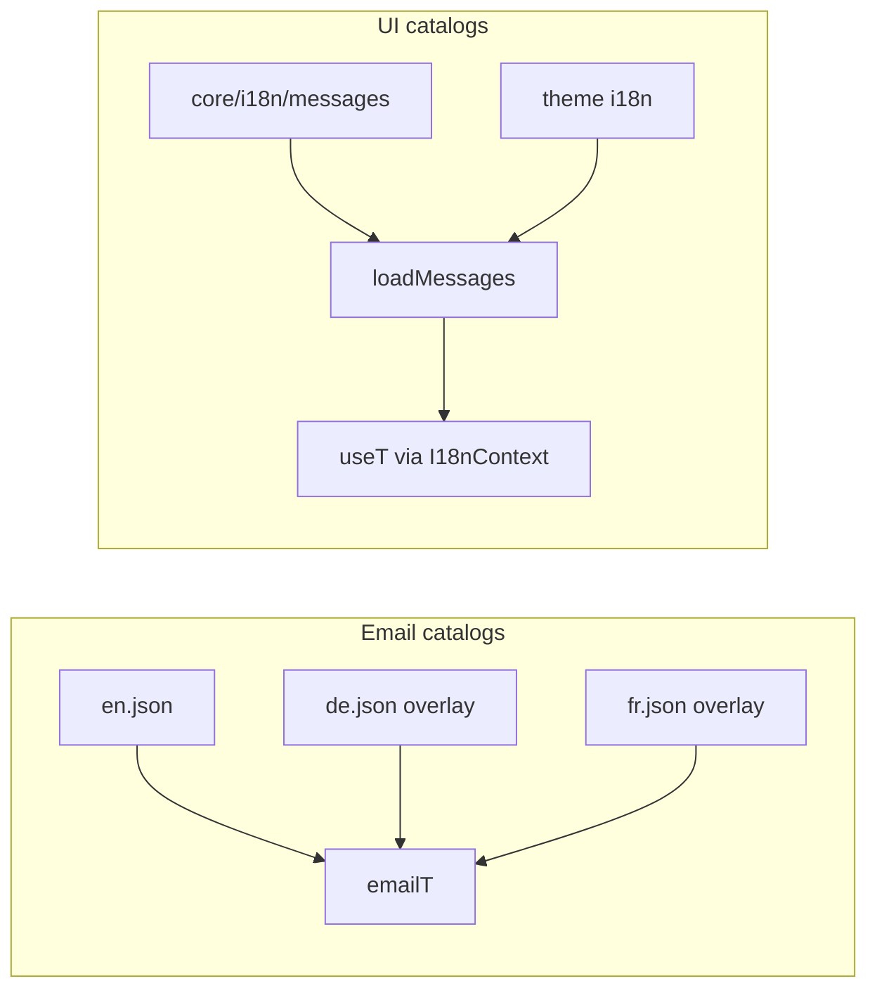

# Translation follow-ups implementation plan

> **For agentic workers:** REQUIRED SUB-SKILL: Use superpowers:subagent-driven-development (recommended) or superpowers:executing-plans to implement this plan task-by-task. Steps use checkbox (`- [ ]`) syntax for tracking.

**Goal:** Complete the remaining i18n follow-ups from the shop email catalog work: fill de/fr email gaps, migrate auth templates onto the same catalogs, start admin UI extraction via the already-wired `useT` context (with en-fallback so locale switching works), and defer full catalog flattening/CI coverage.

**Architecture:** Reuse `emailT` + flat `app/emails/i18n/*.json` for all transactional copy (shop + auth). Admin UI copy lives in core `app/core/i18n/messages/` and is consumed via `I18nContext` / `useT()`. Theme catalogs remain storefront-only.

**Tech Stack:** Existing `#/core/i18n` (`translate`, `useT`, `loadMessages`), `#/emails/i18n.server` (`emailT`, `loadEmailMessages`), React Email templates, Vitest.

**Sources:** Follow-ups left after [PR #172](https://github.com/bermooda/bermooda/pull/172) (`refactor(emails): move shop copy to flat JSON catalogs`).

## Global constraints

- Conventional Commits on every commit (`docs:`, `feat:`, `fix:`, `refactor:`, `test:` as appropriate).
- JS/JSX in `app/` (no TypeScript). JSDoc on every new/changed export.
- Imports use `#/*` (except relative siblings inside themes/plugins).
- Do not bump `package.json` version; release-please owns releases.
- Each implementation PR: `npm run lint`, `npm run build`, and relevant `npm run test` before merge.
- Prefer small PRs per phase below.

## Current state

| Surface | Catalog | Pattern | Gaps |
| --- | --- | --- | --- |
| Shop emails | [`app/emails/i18n/*.json`](../../app/emails/i18n/en.json) | flat keys + `emailT(locale)` with en overlay | de missing 5 templates; fr missing those + admin reset/invite |
| Auth emails | none | hardcoded in [`app/emails/templates/`](../../app/emails/templates/) + `SUBJECT_*` constants | welcome, verify, reset, 2FA |
| Admin UI | [`app/core/i18n/messages/en.json`](../../app/core/i18n/messages/en.json) only | [`I18nContext`](../../app/routes/admin/_layout.jsx) wired; **`useT()` unused** | ~78 admin routes + ~35 components; nav/layout English literals |
| UI loader | [`loadMessages`](../../app/core/i18n/index.server.js) | deep-merge core/theme/plugin for requested locale only | no en-fallback; nested keys |



## Delivery order

Ship as **three implementation PRs** (emails first, then admin + minimal hardening). Catalog flatten + CI stay a later fourth track. This document itself is the roadmap only.

---

### Phase 1 — Complete email locales + migrate auth templates

#### A. Fill incomplete shop locales

- [ ] Add missing keys to [`app/emails/i18n/de.json`](../../app/emails/i18n/de.json) and [`app/emails/i18n/fr.json`](../../app/emails/i18n/fr.json) so both match all 69 `en` keys:
  - **de + fr:** `orderShipped.*`, `orderDelivered.*`, `orderRefunded.*`, `returnReceived.*`, `backInStock.*`
  - **fr only:** `passwordResetAdmin.*`, `staffInvite.*`
- [ ] Update [`app/emails/i18n.test.server.js`](../../app/emails/i18n.test.server.js): assert de/fr overlays for previously English-fallback keys (replace the “No DE source for order shipped” expectation).

#### B. Auth templates → same JSON catalogs

Reuse `emailT` / flat keys — do not invent a second catalog system.

- [ ] Add flat keys to `en.json` (and de/fr in the same PR), e.g.:
  - `authWelcome.*` (preview, heading, subheading, body, list items, cta, subject)
  - `authVerify.*`
  - `authResetPassword.*`
  - `authTwoFactor.*`
- [ ] Refactor templates to accept `locale` and call `emailT(locale)`:
  - [`welcome.server.jsx`](../../app/emails/templates/welcome.server.jsx)
  - [`verify-email.server.jsx`](../../app/emails/templates/verify-email.server.jsx)
  - [`reset-password.server.jsx`](../../app/emails/templates/reset-password.server.jsx)
  - [`two-factor-otp.server.jsx`](../../app/emails/templates/two-factor-otp.server.jsx)
- [ ] In [`app/emails/index.server.jsx`](../../app/emails/index.server.jsx): drop `SUBJECT_*` constants; resolve subjects via `emailT(locale)('auth….subject', …)`; pass `locale` into templates.
- [ ] **Locale resolution** (auth callbacks have no request locale):
  - Inside each `send*` (or a small helper): `settingsGet('defaultLocale')` → validate → else `'en'`.
  - For customer-facing verify/welcome/reset when a customer id/email is known, prefer `customer.preferredLocale` when set (same idea as order emails in [`job.server.js`](../../app/emails/job.server.js)).
  - Thread `locale` through queue payloads in [`job.server.js`](../../app/emails/job.server.js) so workers stay locale-aware.
- [ ] Keep better-auth call sites thin ([`createEmailVerificationConfig`](../../app/libs/auth/shared/index.server.js), admin/customer reset hooks) — locale resolved in email send layer.
- [ ] Validation: `npm run test -- app/emails/i18n.test.server.js` (+ any auth email send tests); lint + build.

---

### Phase 2 — Admin UI copy via `useT` + en-fallback prerequisite

#### A. Minimal catalog hardening pulled forward

Without this, switching admin locale to `de`/`fr` yields empty catalogs and raw keys.

- [ ] In [`loadMessages`](../../app/core/i18n/index.server.js):
  1. Always load `en` core (+ theme/plugin en) as base.
  2. Deep-merge the requested locale on top (same merge order: core → theme → plugins).
  3. Cache key stays `i18n:${locale}`; extend [`index.test.server.js`](../../app/core/i18n/index.test.server.js) for en-fallback when locale file is missing/partial.
- [ ] Do **not** flatten nested keys or add CI coverage in this phase.

#### B. Catalog shape for new admin strings

- [ ] Add flat dotted keys into [`app/core/i18n/messages/en.json`](../../app/core/i18n/messages/en.json) (and de/fr for keys extracted in this phase). Example:

```json
{
  "common.save": "Save",
  "admin.nav.overview": "Overview",
  "admin.nav.dashboard": "Dashboard",
  "admin.chrome.logout": "Logout"
}
```

- [ ] Leave existing nested `common` / `admin.topbar` entries in place for now (`resolveMessageKey` already supports nested + flat). Theme catalogs stay storefront-only (external theme package); admin copy lives in **core** messages only.

#### C. Start using `useT()` — phased extraction

Context is already provided in [`AdminLayout`](../../app/routes/admin/_layout.jsx). Prefer `useT()` from `#/core/i18n` over local `translate` wrappers in components.

**Wave 1 — chrome + shared shell**

- [ ] [`nav-config/index.js`](../../app/components/admin/nav-config/index.js): change `label` / `name` to message keys (e.g. `admin.nav.products`); resolve with `useT()` where rendered in `_layout.jsx` / command palette.
- [ ] Admin layout chrome: “View storefront”, “Logout”, “Open sidebar”, “Close sidebar”, command-palette aria, theme labels.
- [ ] Shared primitives with stable copy: [`page-header.jsx`](../../app/components/admin/page-header.jsx), [`empty-state.jsx`](../../app/components/admin/empty-state.jsx), [`breadcrumbs.jsx`](../../app/components/admin/breadcrumbs.jsx), [`pagination.jsx`](../../app/components/admin/pagination.jsx), [`command-palette.jsx`](../../app/components/admin/command-palette.jsx) (static strings only).
- [ ] Validation: unit tests for `loadMessages` fallback; nav-config tests updated for keys; lint + build; smoke admin layout locale switch shows translated chrome.

**Wave 2+ — route batches by nav group**

- [ ] Catalog → Sales → Content → Settings → … Pattern per page: extract literals → `en` (+ de/fr when practical) → `const t = useT()`.
- [ ] Do not block Phase 2 on translating all 78 routes; ship shell + en-fallback + documented extraction pattern first.

---

### Phase 3 — Remaining catalog hardening (later)

Separate, lower priority:

- [ ] **Normalize core nested keys to flat** — migrate remaining nested entries in `messages/en.json`; keep `resolveMessageKey` dual lookup until callers are audited, then simplify if desired.
- [ ] **Optional CI key-coverage** — script comparing `en` vs `de`/`fr` for `app/emails/i18n` and `app/core/i18n/messages` (fail on missing keys); wire into CI when catalogs are mature.
- [ ] Continue admin route extraction waves until coverage is complete.

---

## Non-goals

- Reworking storefront theme string extraction (lives in external theme packages).
- Merging auth templates into `app/emails/shop/` (keep auth vs shop split; share catalogs only).
- Manual package version bumps (release-please).

## Risk notes

- Auth locale without request context must not guess from `Accept-Language` in the queue worker — use settings / customer preference only.
- Nav-config becoming key-based will break tests that assert English labels — update tests to keys or render through `t()`.
- `loadMessages` en-fallback changes cache contents for non-en locales — existing tests that mock a single `readFileSync` need updating for base+overlay reads.
