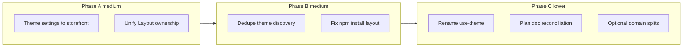

# Themes/Plugins Architecture Follow-ups Implementation Plan

> **For agentic workers:** REQUIRED SUB-SKILL: Use superpowers:subagent-driven-development (recommended) or superpowers:executing-plans to implement this plan task-by-task. Steps use checkbox (`- [ ]`) syntax for tracking.

**Goal:** Finish the themes/plugins hardening work left after PR #178 — wire theme settings into storefront render, unify Layout ownership, dedupe theme discovery, fix npm extension install layout, then tackle lower-priority naming/docs/debt items.

**Architecture:** Keep the existing extension model (disk-installed packages, static dispatchers, dual theme registries for client/server). Prefer contract unification and small correctness fixes over redesign. Theme settings flow through page context like `themeId`/`locale`/`currency`. Theme discovery keeps Vite globs on server and client but shares merge/index helpers so failure modes stay aligned. Layout chrome is owned by theme page components (self-wrap); route modules stop wrapping `Layout` except the plugin apps host.

**Tech Stack:** React Router 7, Vite `import.meta.glob`, Vitest, oxlint, JSDoc/`checkJs`, existing `#/core/themes` + `#/core/storefront/page-context.server`.

**Prerequisite:** PR #178 (`fix: harden themes/plugins architecture and storefront contracts`) is merged. Read `docs/themes.md` and `docs/plugins.md` before changing contracts.

**Out of scope for this plan:** Multi-tenant schema, marketplace plugin sandboxing, plugin-owned Prisma models, exclusive providers beyond email, awaiting domain-event handlers in the queue worker.

## Global Constraints

- Conventional Commits on every commit (`feat:`, `fix:`, `refactor:`, `docs:`, `test:`, `chore:` as appropriate).
- JS/JSX in `app/` (no TypeScript). JSDoc on every new/changed export.
- Imports use `#/*` (except relative siblings inside themes/plugins).
- Do not bump `package.json` version; release-please owns releases.
- Do not reintroduce silent `getStorefrontComponent` fallbacks to “first registered theme”.
- Each task ends with targeted tests green; before PR: `npm run lint`, `npm run build`, and relevant `npm run test`.
- Prefer small PRs per phase (A→E) if landing incrementally.

## Background (what #178 already landed)

| Area                   | Done in #178                                                                                      |
| ---------------------- | ------------------------------------------------------------------------------------------------- |
| Plugin enable rollback | `onEnable` throw unwinds hooks/providers; Setting rolled back                                     |
| Theme resolution       | No silent theme fallback; require real `themeId`                                                  |
| i18n                   | `pluginOrder ∩ enabledPlugins`; bust `i18n:` on theme/plugin change                               |
| Page context           | Most storefront loaders use `loadStorefrontPageContext`                                           |
| Settings hub           | Leaf parsers (`tax/input`, `shipping/zones-input`, `address-validation/input`)                    |
| Plugin isolation       | `whenReady()` before traffic; `getPluginSetting`/`setPluginSetting`; oxlint Prisma ban in plugins |
| Docs                   | `docs/themes.md` / `docs/plugins.md` aligned with live contracts                                  |

## File map

| Path                                                              | Responsibility                                                                                   |
| ----------------------------------------------------------------- | ------------------------------------------------------------------------------------------------ |
| `app/core/storefront/page-context.server.js`                      | Extend with theme settings for storefront render                                                 |
| `app/core/themes/index.server.js`                                 | `loadThemeSettings`, discovery; stop dual-glob if client stops discovering                       |
| `app/core/themes/storefront-components/index.js`                  | Client registry: register-only (no eager glob) or shared discover helper                         |
| `app/routes/404.jsx`                                              | Stop wrapping `Layout` once NotFoundPage self-wraps                                              |
| `app/routes/storefront/apps/$pluginId.jsx`                        | Stop wrapping `Layout` once plugin pages receive chrome via theme Layout helper or page contract |
| Theme package `components/*` (external `@bermooda/theme-default`) | Self-wrap Layout; consume `themeSettings` props                                                  |
| `scripts/install-default-extensions.mjs`                          | npm pack + extract fallback (not `npm install --prefix`)                                         |
| `app/hooks/use-theme.jsx` → `use-color-mode.jsx` (or similar)     | Rename light/dark UI mode away from “theme”                                                      |
| `docs/themes.md`, `docs/plugins.md`                               | Contract updates for this follow-up                                                              |
| `docs/superpowers/plans/2026-08-01-architecture-improvements.md`  | Mark landed phases done / note superseded                                                        |



---

## Phase A — Storefront contract completion (medium impact)

### Task 1: Pass theme settings into storefront page context

**Files:**

- Modify: `app/core/storefront/page-context.server.js`
- Modify: `app/core/storefront/page-context.test.server.js` (create if missing assertions)
- Modify: storefront loaders / theme components that need settings (start with layout-facing pages)
- Modify: `docs/themes.md` (remove “not wired to storefront” once done)

**Interfaces:**

- Consumes: `preloadStorefrontTheme`, `resolveActiveTheme` / `getRegisteredTheme`, `loadThemeSettings(manifest)`
- Produces: `loadStorefrontPageContext(request)` → `{ themeId, locale, currency, themeSettings }`
  - `themeSettings` is `Record<string, unknown>` (empty object when theme has no settings schema)

**Current gap:** `loadThemeSettings` / `saveThemeSettings` work in admin; storefront loaders never call them.

- [ ] **Step 1: Write failing test for page context shape**

In `app/core/storefront/page-context.test.server.js`, mock themes + settings and assert:

```js
it('includes themeSettings from the active theme manifest', async () => {
  // mock preloadStorefrontTheme → '@bermooda/theme-default'
  // mock getRegisteredTheme → { id, settings: [{ key: 'accentColor', type: 'text' }] }
  // mock loadThemeSettings → { accentColor: '#111' }
  const ctx = await loadStorefrontPageContext(new Request('http://localhost/'));
  expect(ctx.themeSettings).toEqual({ accentColor: '#111' });
});
```

- [ ] **Step 2: Run test to verify it fails**

```bash
npm run test -- app/core/storefront/page-context.test.server.js
```

Expected: FAIL (property missing / undefined).

- [ ] **Step 3: Extend `loadStorefrontPageContext`**

```js
/**
 * @param {Request} request
 * @returns {Promise<{
 *   themeId: string,
 *   locale: string,
 *   currency: string,
 *   themeSettings: Record<string, unknown>,
 * }>}
 */
export async function loadStorefrontPageContext(request) {
  const [themeId, locale, currency] = await Promise.all([
    preloadStorefrontTheme(),
    getRequestLocale(request),
    getRequestCurrency(request),
  ]);
  const manifest = getRegisteredTheme(themeId);
  const themeSettings = manifest ? await loadThemeSettings(manifest) : {};
  return { themeId, locale, currency, themeSettings };
}
```

Avoid importing the full themes barrel if that creates a cycle; import `loadThemeSettings` + `getRegisteredTheme` from the same modules page-context already can reach, or add a thin `loadActiveThemeSettings()` helper on the themes server module.

- [ ] **Step 4: Thread `themeSettings` through loaders that return theme page props**

At minimum:

- `app/routes/storefront/index.jsx`
- `app/routes/storefront/_layout.jsx` if layout slots need settings
- Account layout if AccountLayout needs settings

Pass `themeSettings` as a prop into `getStorefrontComponent(...)` page components. Do **not** invent a React context unless an existing theme already expects one — prefer props to match current loader→component style.

- [ ] **Step 5: Update default theme (sibling package) only if needed**

If `@bermooda/theme-default` should read settings (e.g. accent color), change that package in its sibling repo / installed copy under `app/themes/default/`. Do not hardcode settings keys in core beyond the schema-driven map.

- [ ] **Step 6: Docs + validate**

Update `docs/themes.md` Theme settings section: settings are available as `themeSettings` from `loadStorefrontPageContext`.

```bash
npm run test -- app/core/storefront app/routes/storefront/index.test.jsx
npm run lint
```

- [ ] **Step 7: Commit**

```bash
git add -A
git commit -m "feat(themes): pass theme settings into storefront page context"
```

---

### Task 2: Unify Layout ownership (self-wrap)

**Decision (locked):** Theme page components own chrome by wrapping themselves in `Layout`. Route modules must **not** wrap `Layout` around theme pages. Exceptions today (`404.jsx`, `apps/$pluginId.jsx`) must be migrated to match.

**Files:**

- Modify: theme `NotFoundPage` / plugin storefront shell usage (theme package + routes)
- Modify: `app/routes/404.jsx` — render only `NotFoundPage`
- Modify: `app/routes/storefront/apps/$pluginId.jsx` — stop resolving/wrapping `Layout`; either:
  - require plugin storefront pages to render inside a theme-provided shell component prop, **or**
  - resolve a dedicated `PluginAppPage` / pass `Layout` as a prop for the plugin route module to compose once without route-level chrome ownership
- Prefer: keep a single `Layout` resolve in the route **only** if the plugin route renders arbitrary plugin content that is not a theme page. In that case document it as the one allowed route-owned chrome for plugin host pages — but still remove 404’s wrap.
- Modify: `docs/themes.md` Layout ownership section to match the final rule
- Test: `app/routes/storefront/apps/$pluginId.test.jsx`, any 404 tests

**Concrete 404 target:**

```js
// app/routes/404.jsx — after NotFoundPage self-wraps Layout
export default function NotFoundRoute() {
  const { themeId, ...data } = useLoaderData();
  const NotFoundPage = getStorefrontComponent('NotFoundPage', themeId);
  if (!NotFoundPage) throw new Error('NotFoundPage theme component not found');
  return <NotFoundPage {...data} />;
}
```

- [ ] **Step 1: Confirm default theme `NotFoundPage` self-wraps `Layout`**

Inspect `app/themes/default/components/not-found-page.jsx` (after `npm run extensions:install`). If it does not wrap `Layout`, add the wrap in the theme package (sibling repo preferred).

- [ ] **Step 2: Update `404.jsx` to stop wrapping Layout**

Remove `getStorefrontComponent('Layout', themeId)` usage from the route.

- [ ] **Step 3: Decide plugin apps host chrome**

**Chosen approach:** Route resolves `Layout` once and wraps the plugin page component **only** for `/apps/:pluginId/*`, because plugin pages are not theme pages and cannot import theme Layout without coupling. Document this as the sole route-owned Layout exception. Remove any redundant comments that imply 404 is also an exception.

- [ ] **Step 4: Update docs**

In `docs/themes.md`:

- Page components self-wrap `Layout`
- Account uses `AccountLayout` in `account/_layout.jsx`
- Checkout page **is** `CheckoutLayout`
- Plugin dispatcher may wrap `Layout` around plugin content
- `404` does not wrap `Layout`

- [ ] **Step 5: Validate + commit**

```bash
npm run test -- app/routes/storefront/apps/$pluginId.test.jsx
git add -A
git commit -m "refactor(themes): unify Layout ownership with self-wrap pages"
```

---

## Phase B — Discovery and install integrity (medium impact)

### Task 3: Deduplicate theme discovery

**Problem:** Both `app/core/themes/index.server.js` and `app/core/themes/storefront-components/index.js` eagerly `import.meta.glob('#/themes/*/index.js')` with different failure modes (server throws on bad package; client silently skips).

**Chosen approach:** Keep Vite glob **only** in the client-safe `storefront-components` module (needed for browser + SSR component graph). Server discovery calls `registerStorefrontTheme` after validating, and **also** relies on the client module’s eager glob for SSR hydration consistency — **or** extract a shared pure `buildThemeManifest(pkg, runtime)` helper and leave two globs but shared merge/validate.

**Preferred concrete approach (smaller risk):**

1. Extract shared helpers into `app/core/themes/discover-shared.js` (client-safe):
   - `buildMergedThemeManifest(pkg, runtime)` wrapping `mergeExtensionPackage`
   - `indexThemeManifest(THEMES, manifest)` (id + slug keys)
2. Both globs call the shared helpers
3. Align failure modes: malformed packages are skipped with a logger on server; client continues to skip silently (no logger in browser). Document that.

**Files:**

- Create: `app/core/themes/discover-shared.js`
- Modify: `app/core/themes/index.server.js`
- Modify: `app/core/themes/storefront-components/index.js`
- Modify: `app/core/themes/storefront-components/index.test.js`
- Modify: `docs/themes.md` (discovery section)

- [ ] **Step 1: Extract shared merge/index helpers (client-safe)**

```js
// app/core/themes/discover-shared.js
import { mergeExtensionPackage } from '#/core/extensions/package-meta';

/**
 * @param {object} pkg
 * @param {object} runtime
 * @returns {object}
 */
export function buildMergedThemeManifest(pkg, runtime) {
  return mergeExtensionPackage(pkg, runtime);
}

/**
 * @param {Record<string, object>} registry
 * @param {object} manifest
 * @returns {void}
 */
export function indexThemeManifest(registry, manifest) {
  registry[manifest.id] = manifest;
  if (manifest.slug) registry[manifest.slug] = manifest;
}
```

- [ ] **Step 2: Point both discovery loops at the helpers**

No behavior change yet beyond shared code path.

- [ ] **Step 3: Add a test that registering via `registerStorefrontTheme` indexes id + slug**

Already partially covered; ensure discover-shared unit tests exist.

- [ ] **Step 4: Validate + commit**

```bash
npm run test -- app/core/themes
git commit -m "refactor(themes): share theme discovery merge helpers"
```

**Follow-up stretch (same PR only if small):** Remove server-side component map expectations from duplicated runtime imports if server registry only needs identity/settings/slots — keep components solely in storefront-components. Do **not** expand into a large redesign in this task.

---

### Task 4: Fix npm fallback install layout for extensions

**Problem:** `scripts/install-default-extensions.mjs` `installFromNpm` runs `npm install --prefix app/themes/<slug> <packageId>`, which nests the package under `app/themes/<slug>/node_modules/<packageId>/` instead of placing `index.js` + `package.json` at `app/themes/<slug>/`. Discovery expects `app/themes/<slug>/index.js`. Sibling `cpSync` path is fine.

**Chosen approach:** `npm pack <packageId>` → extract tarball contents into `destDir` (same layout as sibling copy), then run `install-extension-deps`.

**Files:**

- Modify: `scripts/install-default-extensions.mjs`
- Optionally add: `scripts/install-default-extensions.test.mjs` if the repo has script tests; otherwise a dry-run manual check documented in the PR
- Modify: `app/themes/README.md` and/or `docs/themes.md` install notes if they mention the broken path

- [ ] **Step 1: Replace `installFromNpm` with pack + extract**

```js
import { mkdtempSync, rmSync, readFileSync, writeFileSync } from 'node:fs';
import { tmpdir } from 'node:os';
import { createRequire } from 'node:module';

function installFromNpm(spec) {
  console.log(
    `extensions:install  ${spec.packageId}  ← npm pack (sibling not found)`
  );
  const tmp = mkdtempSync(join(tmpdir(), 'bermooda-ext-'));
  try {
    const packed = execFileSync(
      'npm',
      ['pack', spec.packageId, '--pack-destination', tmp],
      {
        encoding: 'utf8',
        cwd: REPO_ROOT,
      }
    )
      .trim()
      .split('\n')
      .pop();
    const tarball = join(tmp, packed);
    mkdirSync(spec.destDir, { recursive: true });
    execFileSync('tar', ['-xzf', tarball, '-C', tmp], { stdio: 'inherit' });
    // npm pack extracts to package/
    const extracted = join(tmp, 'package');
    if (
      !existsSync(join(extracted, 'index.js')) &&
      !existsSync(join(extracted, 'package.json'))
    ) {
      throw new Error(`Unexpected pack layout for ${spec.packageId}`);
    }
    copyExtension(extracted, spec.destDir);
  } catch (err) {
    console.error(
      `extensions:install  FAILED to install ${spec.packageId} via npm pack. ` +
        `Clone the sibling repo at ${spec.siblingDir} or publish the package first.`,
      err
    );
    process.exit(1);
  } finally {
    rmSync(tmp, { recursive: true, force: true });
  }
}
```

Adjust extract path if `npm pack` naming differs; verify with one real package in CI/cloud.

- [ ] **Step 2: Align the file header comment** with the real pack+extract behavior (it already claims pack but code used `--prefix`).

- [ ] **Step 3: Manual verify locally**

```bash
rm -rf app/themes/default
# with sibling absent or temporarily renamed:
npm run extensions:install
test -f app/themes/default/index.js && test -f app/themes/default/package.json
```

- [ ] **Step 4: Commit**

```bash
git add scripts/install-default-extensions.mjs
git commit -m "fix(extensions): install npm fallback via pack and extract"
```

---

## Phase C — Documented assumptions (no code unless promoting)

These were documented in #178. Only implement if a concrete multi-instance deploy need appears.

| Assumption                         | Current contract                                     | Possible future work                                    |
| ---------------------------------- | ---------------------------------------------------- | ------------------------------------------------------- |
| Single-process plugin enable       | In-memory registry; admin toggle updates one process | Pub/sub or restart-on-toggle runbook                    |
| Single-process `activeTheme` cache | TTL + local bust                                     | Include theme id in cache key cluster-wide or short TTL |
| Admin plugin routes ignore enabled | Intentional for config                               | Gate mutations only if abuse appears                    |
| `ctx.queue` any job name           | Documented constraint                                | Namespaced job registration API                         |

- [x] **Step 1: Optional runbook blurb**

Add a short “Multi-instance deploys” subsection under `docs/plugins.md` Single-process section with: restart all app processes after enable/disable/theme switch, or accept TTL lag. No code.

- [x] **Step 2: Commit if docs changed**

```bash
git commit -m "docs(plugins): clarify multi-instance extension cache behavior"
```

---

## Phase D — Lower priority hygiene

### Task 5: Rename light/dark `use-theme` to avoid storefront clash

**Files:**

- Rename: `app/hooks/use-theme.jsx` → `app/hooks/use-color-mode.jsx`
- Rename exports: `useTheme` → `useColorMode`, `ThemeProvider` → `ColorModeProvider` (or keep Provider name if disruptive — prefer full rename)
- Update imports: `app/root.jsx`, `app/components/ui/logo.jsx`, `app/routes/admin/_layout.jsx`, any tests
- Update cookie/localStorage key only if safe (`theme` key can remain for backward compatibility with stored preference)

- [ ] **Step 1: Rename file + exports; re-export deprecated aliases for one release if needed**

Prefer hard cut (pre-production): no deprecated aliases.

- [ ] **Step 2: Update all callers**

```bash
rg -n "use-theme|useTheme|ThemeProvider" app --glob '*.{js,jsx}'
```

- [ ] **Step 3: Validate + commit**

```bash
npm run test -- app/hooks app/root.jsx
git commit -m "refactor: rename use-theme to use-color-mode"
```

---

### Task 6: Reconcile the Aug 1 architecture improvements plan

**Files:**

- Modify: `docs/superpowers/plans/2026-08-01-architecture-improvements.md`

Phases A–E largely landed before/with #178. Unchecked boxes mislead agents.

- [ ] **Step 1: Mark completed phases/tasks with `[x]`** based on current code reality
- [ ] **Step 2: Add a status banner at the top**

```markdown
> **Status (2026-08-02):** Phases A–E are largely implemented on `master`.
> Remaining extension follow-ups live in
> `docs/superpowers/plans/2026-08-02-themes-plugins-architecture-follow-ups.md`.
```

- [ ] **Step 3: Commit**

```bash
git commit -m "docs: mark architecture improvements plan phases complete"
```

---

### Task 7 (optional / separate PRs): Split oversized domain modules

Mirror the `orders/` and `plugins/` split pattern. **Do not mix into the same PR as Phase A/B.**

| Module                               | Approx. lines | Suggested seams                         |
| ------------------------------------ | ------------- | --------------------------------------- |
| `app/core/reporting/index.server.js` | ~869          | kpis, sales, inventory, exports helpers |
| `app/core/content/index.server.js`   | ~846          | pages, menus, blogs                     |
| `app/core/b2b/index.server.js`       | ~839          | companies, catalogs, quotes             |
| `app/core/marketing/index.server.js` | ~789          | campaigns, abandoned-cart, sequences    |
| `app/core/exports/index.server.js`   | ~693          | jobs vs query builders                  |

For each domain chosen:

1. Identify pure leaf functions with no cycle risk
2. Move to `*.server.js` siblings
3. Keep `index.server.js` as a thin barrel
4. Update imports that can point at leaves
5. Targeted tests + commit per domain: `refactor(<domain>): split index.server into concern modules`

---

## Phase E — Validation gate (every PR)

Before opening or updating a PR for any phase:

```bash
npm run lint
npm run build
npm run test -- app/core/themes app/core/storefront app/core/plugins app/routes/storefront
```

Fix oxfmt with `npm run fmt` if needed.

---

## Suggested PR sequence

1. **PR1 — Phase A** (theme settings + Layout ownership) — `feat` / `refactor`
2. **PR2 — Phase B** (discovery helpers + npm pack install) — `refactor` / `fix`
3. **PR3 — Phase D Task 5–6** (rename + plan reconciliation) — `refactor` / `docs`
4. **PR4+ — Task 7** one domain per PR — `refactor`

---

## Self-review checklist

- [x] Theme settings wired — Task 1
- [x] Layout ownership unified — Task 2
- [x] Discovery dedupe — Task 3
- [x] npm install layout — Task 4
- [x] Documented assumptions — Phase C
- [x] use-theme rename — Task 5
- [x] Aug 1 plan reconciliation — Task 6
- [x] Oversized domains — Task 7 (optional, separate PRs)
- [x] No silent theme fallback reintroduced
- [x] Conventional Commits + preflight called out
